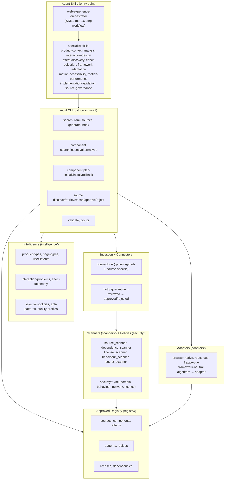
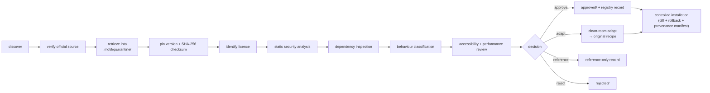

# Motif Architecture

Motif is an **intelligence and governance system** for UI
interactions, motion and effects, not an animation bundle. Its job is to help an AI
coding agent decide what a user needs to *understand, feel or accomplish*, then select
and implement the **least complex interaction** that achieves it, safely and with full
provenance.

This document describes the layers, how they fit together, and the secure ingestion
pipeline that brings any external material under governance.

## Design invariants

These hold across every layer and override convenience:

- **Intelligence over inventory.** Reason from product context down to implementation.
  Search for a **PATTERN before an EFFECT**.
- **Websites vs web applications are distinguished** at every decision. A marketing
  website optimises persuasion; a web application optimises task completion and repeated
  use. The same effect is rarely right for both.
- **Vue and Frappe-Vue are first-class** adaptation targets, alongside browser-native
  and React. Never install one framework to obtain an effect for another.
- **Offline approved registry is the default runtime mode.** The internet is reached
  only through an explicit `source refresh` / new-source workflow.
- **Untrusted by default.** All retrieved material is quarantined and **never executed
  during ingestion**.
- **Licence gate.** Unknown licence ⇒ `reference-only`, never `bundled`.
- **Accessibility and reduced motion are mandatory.** Performance budgets are explicit.
  Ranking is transparent.

## Layer overview



### Skills layer

`SKILL.md` is the root orchestrator: an 8-level reasoning model (development purpose →
product type → user intent → page/screen type → interaction objective → pattern → effect
→ implementation) and a 16-step workflow. Specialist skills in `skills/` are loaded
selectively as the workflow demands. Skills hold judgement; the CLI holds enforcement.

### motif CLI layer

`python -m motif` is the single tool surface. It is **dependency-free core** (Python
standard library only) so `make check` runs anywhere; optional tools such as
`jsonschema` are used if present but never required. The CLI enforces the
offline-approved-registry default, it is preferred over ad-hoc internet retrieval.

### Intelligence layer

`intelligence/` holds the machine-readable knowledge that drives reasoning *before* any
effect is considered: product/page/user taxonomies, interaction problems, the effect
taxonomy, selection policies, anti-patterns and quality profiles.

### Registry layer

`registry/` is the committed, offline-by-default catalogue: `sources`, `components`,
`effects`, `patterns`, `recipes`, plus `licenses` and `dependencies`. Every record
validates against a schema in `schemas/`. This is what normal usage reads.

### Adapters layer

`adapters/` turns a framework-neutral algorithm into a project-specific implementation
for `browser-native`, `react`, `vue` and `frappe-vue`. See
[framework-adaptation.md](framework-adaptation.md).

### Connectors + ingestion layer

`connectors/` (a strict `generic-github` connector plus justified source-specific
connectors) retrieve **only** from approved official locations into quarantine. A
connector may read public metadata and collect licence/attribution; it must **not**
execute code, run install scripts, modify a target project, follow unknown domains,
access secrets or open binaries. Quarantine state lives under `.motif/`.

### Scanners + policies layer

`scanners/` (`source_scanner`, `dependency_scanner`, `license_scanner`,
`behaviour_scanner`, `secret_scanner`) statically analyse quarantined material against the
policies in `security/*.yml`. Nothing is executed. See [threat-model.md](threat-model.md).

## Ingestion pipeline

Every piece of external material follows the same one-way pipeline. Internet access only
happens here, via an explicit source-refresh, never during normal registry use.



Operating modes (the connector layer supports three; the runtime default is the first):

1. **Offline approved registry** *(default)*, read committed registry, no network.
2. **Catalogue-only**, metadata and references only, no source retrieval.
3. **Review**, retrieve untrusted text into disposable quarantine for static review; do
   not execute.
4. **Approved installation**, only approved entries are applied to a target project via a
   controlled patch with diff, rollback snapshot and a provenance manifest.

### Quarantine state machine

```
.motif/quarantine/  → material as retrieved, untrusted, never executed
        │ static scan + licence + dependency + behaviour review
        ▼
.motif/reviewed/    → scanned, findings recorded
        │ decision
        ├──► .motif/approved/   (redistributable, licence-clear, scans clean)
        └──► .motif/rejected/   (unsafe, licence-incompatible, or unverifiable)
```

A clean-room adaptation produces an **original** recipe that retains no source code; the
quarantined original is not redistributed.

## Trust tiers

Sources carry a tier 1-5 (`source.schema.json`). Lower trust requires stronger review.

| Tier | Meaning | Default disposition |
|-----:|---------|---------------------|
| 1 | Official browser/framework documentation | Highest confidence |
| 2 | Established open-source project | Normal review |
| 3 | Maintained component library, clear ownership | Normal review |
| 4 | Community contribution | Stronger review |
| 5 | Unknown or unverifiable | **reference-only or rejected** |

## Status and scope

Motif v0.1.0 ships a **working secure pipeline with representative, high-confidence
records** rather than fabricated breadth. See `PHASE_STATUS.md` for what is complete vs
representative, and [release-process.md](release-process.md) for release discipline.
