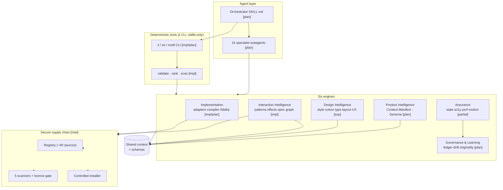
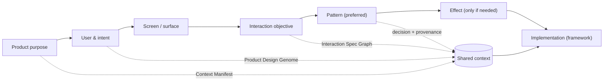
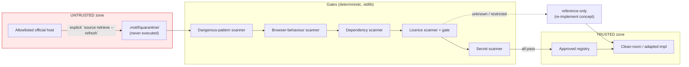
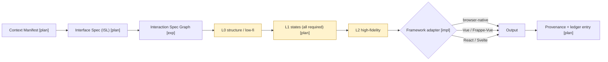
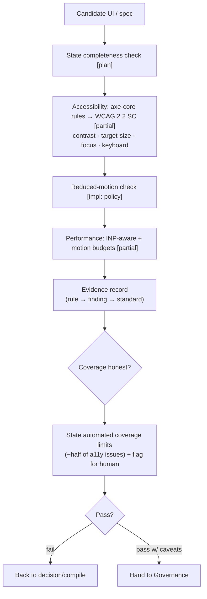
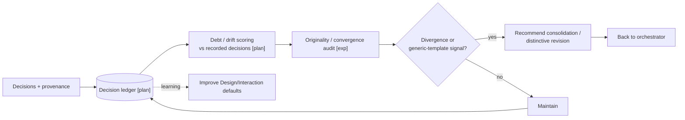
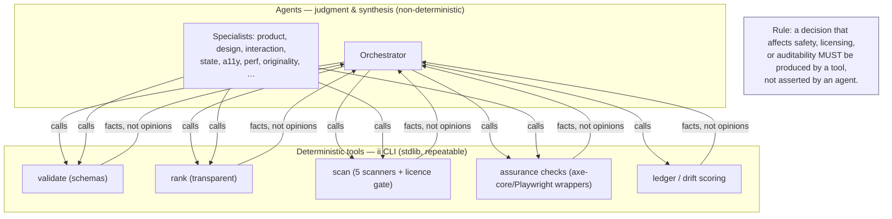

# Architecture — Interface Intelligence OS

> The six-engine architecture of IIOS, with diagrams for module structure, context flow,
> decision flow, the secure-ingestion trust boundary, the compilation pipeline, the
> assurance pipeline, the governance loop, and the agent/deterministic-tool boundary.
>
> **Honesty marker on diagrams.** Boxes are tagged where useful: **[impl]** implemented
> (carried from Motif v1.0.0), **[exp]** experimental, **[plan]** planned. Only the secure
> interaction foundation is fully implemented today; see the roadmap and capability matrix.

---

## 1. Module architecture

IIOS is six cooperating engines over a shared context model and a secure supply chain, all
driven by an orchestrator and exposed through the `ii` CLI and deterministic tools. Engine
names map to top-level directories (`design-intelligence/`, `product-intelligence/`,
`interaction-intelligence/`, `implementations/` + `compiler/`, `assurance/`, `governance/`).



**Key relationships.** Product Intelligence seeds the shared context; Design and Interaction
Intelligence reason over it; Implementation compiles it; Assurance verifies it; Governance
records and maintains it. The secure supply chain underlies Interaction and Implementation
whenever third-party material is involved.

---

## 2. Context flow

Information flows from product understanding down to implementation — never the reverse.
This enforces *reason from context, not aesthetics* and *fidelity follows certainty*.



Each stage writes to the shared context, so later stages (and Assurance/Governance) can see
*why* earlier choices were made. The chain mirrors the foundation's
`purpose > product > intent > screen > objective > pattern > effect > implementation`.

---

## 3. Decision flow

How a single interface decision is made: search for the simplest sufficient option, gate it
on safety, and record it.

```mermaid
flowchart TB
  start(["Need: objective on a surface"]) --> ctx{"Context manifest exists?"}
  ctx -- no --> stop1["Refuse: build context first [fidelity gate]"]
  ctx -- yes --> cand["Generate candidates<br/>(pattern before effect, native before lib)"]
  cand --> rank["Transparent ranking [impl]"]
  rank --> simplest["Pick least-complex sufficient"]
  simplest --> gate{"Safety gates"}
  gate -->|a11y / reduced-motion fail| reject["Reject / choose simpler"]
  gate -->|perf / INP budget fail| reject
  gate -->|licence / security fail| reject
  gate -->|originality: too generic [exp]| revise["Revise toward intentional"]
  gate -->|pass| sel["Select"]
  revise --> cand
  reject --> cand
  sel --> ledger["Record in decision ledger<br/>(rationale + rejected alternatives) [plan]"]
  ledger --> done(["Decision committed"])
```

---

## 4. Secure-ingestion trust boundary

The foundation's defining property: untrusted-by-default ingestion. Nothing third-party is
executed, and nothing crosses into the trusted registry without passing every gate.
**[impl]** — this is shipped in Motif v1.0.0.



The **trust boundary** is the line between quarantine and the approved registry. Default
operation is fully offline against the committed registry; the network is touched only on an
explicit refresh against an allowlisted host. Third-party install scripts never run.

---

## 5. Compilation pipeline

How a verified context becomes framework-correct, own-your-source code, ascending the
fidelity ladder. **[plan for v0.3]**, building on implemented adapters.



The **fidelity gate** between L0→L1→L2 is the enforcement of *fidelity follows certainty*:
the compiler will not emit L2 high-fidelity before L1 state-completeness is satisfied.

---

## 6. Assurance pipeline

Verification with recorded evidence — and honest coverage statements. **[partial → v0.3]**.



Assurance mirrors axe-core's own honesty: it never claims full compliance from automation;
it records what it checked, what passed, and what a human must still review.

---

## 7. Governance loop

The long-horizon coherence loop: record, detect drift, correct, learn. **[plan]**.



The loop keeps quality from silently degrading across a long agent session and feeds
learnings back into design/interaction defaults.

---

## 8. Agent / deterministic-tool boundary

The architectural line that makes IIOS auditable: **judgment** is for agents; anything
**safety-affecting, repeatable, or auditable** runs in deterministic, dependency-free tools.



**Why this boundary.** Agents are powerful but non-deterministic; safety decisions must be
reproducible and inspectable. By pushing validation, scanning, licence gating, ranking,
assurance, and ledger/drift scoring into stdlib-only tools, IIOS guarantees that the same
input yields the same safety verdict, that `make check` runs anywhere, and that every
safety-affecting result is auditable independent of the agent that requested it.

---

## How the engines compose (summary)

| Engine | Reads | Produces | Status |
|--------|-------|----------|:------:|
| Product Intelligence | brief, repo | Context Manifest, Product Design Genome | plan |
| Design Intelligence | context, DTCG tokens, design knowledge | style/colour/type/layout/UX choices | exp |
| Interaction Intelligence | context, registry | pattern/effect selection, Interaction Spec Graph | **impl** |
| Implementation | spec, adapters | framework-correct own-your-source code | impl + plan |
| Assurance | artefact/spec | state/a11y/perf/motion evidence (honest coverage) | partial |
| Governance & Learning | decisions | ledger, drift/debt, originality audit | plan |
| Secure supply chain | external sources | approved registry, provenance | **impl** |

The architecture's load-bearing ideas are constant across statuses: **context before
aesthetics, least complexity that works, fidelity follows certainty, safety in deterministic
tools, and every decision recorded.**
