# Motif v3 "Motif Live", Layered Architecture

> Motif v3 evolves Motif v2.0.0 (intelligence + governance) into a **runtime / execution /
> assurance / governance** platform. The command is `motif` (aliases `ii`, `oii`).
>
> **Honesty is mandatory.** Every box and capability below is tagged:
> **[impl]** implemented and verified by `make check`, **[exp]** experimental (interface +
> static layers built; runtime execution needs a browser runtime not installed here),
> **[plan]** planned (designed, not built). The browser-runtime surfaces, Visual Twin
> screenshot rendering, Playwright/axe assurance, live preview, pixel/semantic visual diff,
> and interactive Studio apply, are **[exp]/[plan]** because no browser runtime (Playwright)
> is present. The deterministic surfaces, findings, policy, memory, Atlas static site, MCP
> server, Guardian, design-system extraction, run/create/improve orchestration,
> recommendation, and the compile plan, are **[impl]**. This document mirrors
> [`docs/reviews/motif-v3-gap-analysis.md`](../reviews/motif-v3-gap-analysis.md); if the two
> ever disagree, the gap analysis wins.

---

## 1. The layered model

Motif v3 reasons top-down from human intent through to a delivered, validated interface, then
feeds evidence back up. Each layer consumes the layer above and emits typed records into
`.motif/` (the runtime state) governed by schemas in `schemas/`.

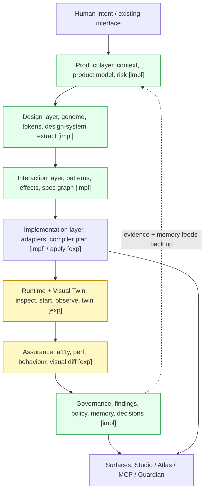

**Reading the stack.** Product establishes *why* and *for whom*; Design fixes the visual
grammar; Interaction selects *patterns before effects*; Implementation compiles a concrete
plan; Runtime brings the target app up in isolation and builds a Visual Twin; Assurance
checks the running result against policy; Governance records findings, decisions and memory;
the Surfaces (Studio, Atlas, MCP, Guardian) expose all of it over one shared source of truth.

---

## 2. Create flow

`motif create` turns a brief into a spec, context, ranked concepts and a compile plan. The
preview and compile-apply tail is experimental (needs rendering).

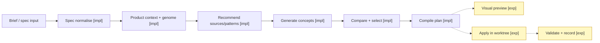

## 3. Improve flow

`motif improve` inspects an existing interface, models it, discovers issues into the unified
Finding model, generates concepts and a plan. Starting the live app and capturing it are
experimental.

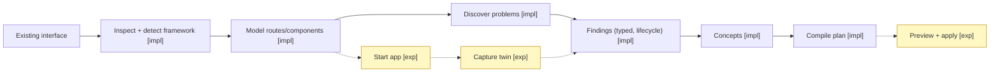

## 4. `motif run`, the flagship runtime pipeline

The full loop. Deterministic stages run today; stages that need a browser are experimental
and gated behind `--allow-runtime`/explicit apply, never default.

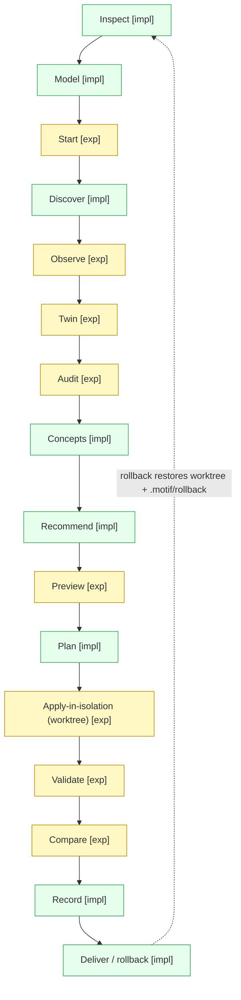

Every run writes a `run-record` (schema `schemas/run-record.schema.json`) into
`.motif/runs/<id>/` capturing mode, goal, target commit, commands, files changed, findings,
concepts and outcome, so a run is reproducible and reversible.

## 5. Visual Twin

A typed, source-derived model of the interface. The manifest, routes and component
fingerprints come from **static source analysis** and are real today; screenshots, the
accessibility tree and traces require Playwright and are experimental.

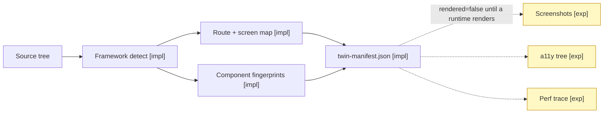

The manifest carries `"rendered": false` until a real runtime fills the pixel layer; nothing
downstream claims visual truth from an unrendered twin.

## 6. Compiler

The compiler extends the v2 controlled installer. `compile plan` is implemented; preview is
experimental; apply/pr are partial and always operate in an isolated worktree.

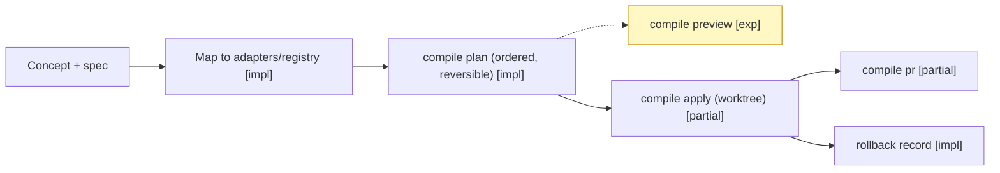

## 7. Assurance

Interface and static-check layers are implemented; runtime layers (Playwright + axe, real
perf, rendered visual regression) are experimental.

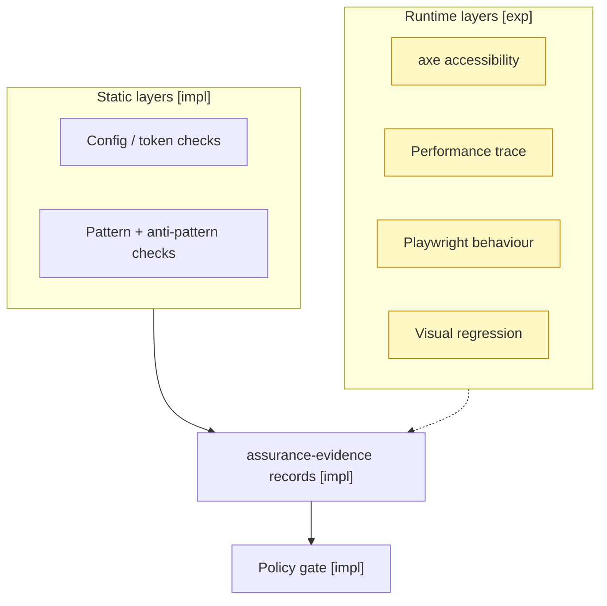

## 8. MCP server

A stdlib JSON-RPC-over-stdio server exposing the shared source of truth to MCP clients.
Read tools are open; write tools are guarded (dry-run default, audit log).

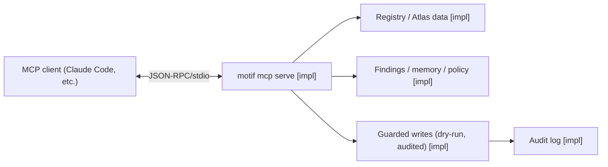

## 9. Guardian

Local + PR-time governance gate over staged/branch diffs, with trend tracking.

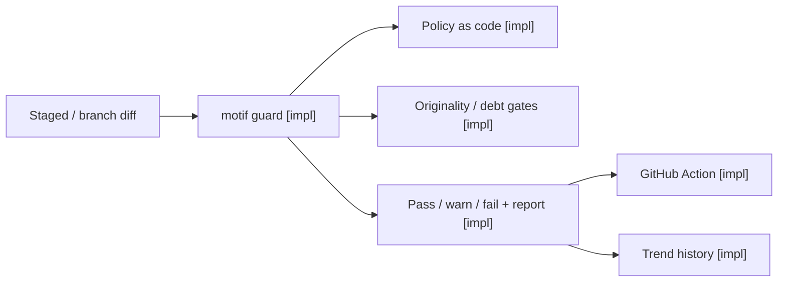

## 10. Source-update lifecycle

New external sources pass through quarantine, scanning and review before entering the
approved registry. Live network refresh is planned; the offline approved registry is the
exercised runtime.

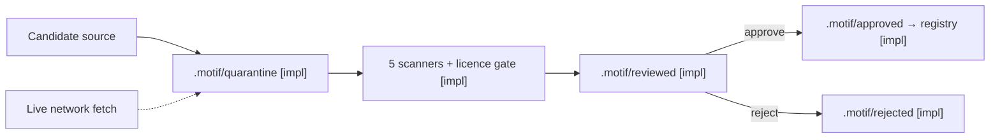

## 11. Data ownership / source of truth

One registry, one set of schemas, many readers. Runtime state lives in `.motif/` (gitignored);
durable knowledge lives in the versioned registry.

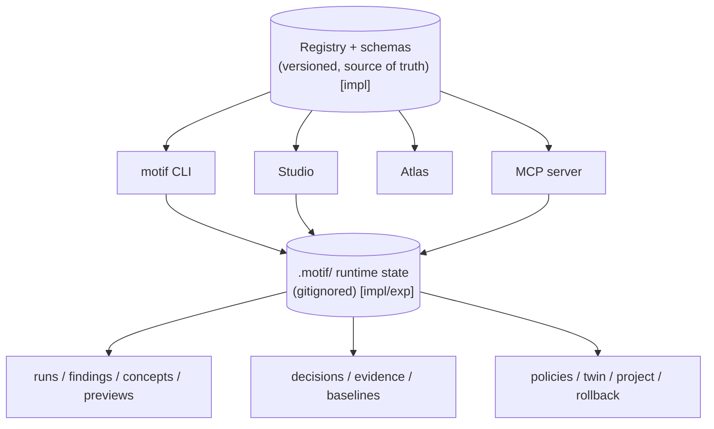

**Ownership rules.** The registry is the single durable source of truth; every surface reads
it through library functions, never a private copy. Per-project, per-run artefacts are owned
by `.motif/` and are reproducible from the registry plus the recorded run. Nothing in
`.motif/` is authoritative knowledge, it is evidence and state.

---

## 12. Status summary

| Layer / surface | Status |
|---|---|
| Product / Design / Interaction reasoning | implemented |
| Implementation: compile plan | implemented; apply/pr partial; preview experimental |
| Runtime: inspect / detect / worktree / run records | implemented; live process start experimental |
| Visual Twin: manifest + static fingerprints | implemented; screenshots / a11y tree / traces experimental |
| Assurance: interface + static layers | implemented; runtime (Playwright/axe) experimental |
| Governance: findings, policy, memory, decisions | implemented |
| Surfaces: Atlas, MCP, Guardian, design-system extract | implemented; Studio viewer implemented, interactive apply experimental |

See the per-surface guides under `docs/` and the
[gap analysis](../reviews/motif-v3-gap-analysis.md) for the authoritative status table.
