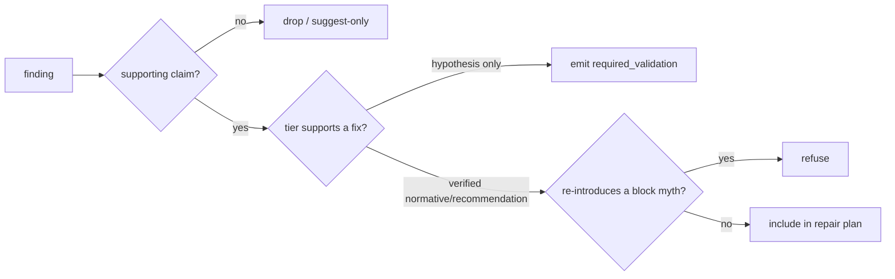

# Evidence-grounded repair, the 21-step golden loop

> Part of Motif v3.1. **Status: the deterministic steps are implemented and run end-to-end; the
> browser-gated steps are experimental and `not-executed` here** (no Playwright/browser, `pip`
> is broken). Mirrors [`docs/reviews/motif-v3-1-gap-analysis.md`](../reviews/motif-v3-1-gap-analysis.md)
> and [`ADR-UXE-001`](../adr/ADR-UXE-001-release-and-integration-strategy.md). Builds on
> [`README.md`](README.md) (`motif improve`).

The golden loop takes a real interface from inspection to a **validated, recorded, reversible**
repair, and refuses to "fix" anything the evidence does not support. Code changes happen only
in an **isolated git worktree**; the user's active branch is never edited without an explicit,
reversible apply.

## The 21 steps

Legend: **D** = deterministic (runs here), **B** = browser-gated (experimental, `not-executed`
here).

```mermaid
flowchart TD
  subgraph Inspect & ground (D)
    s1[1 Inspect target] --> s2[2 Detect framework]
    s2 --> s3[3 Model routes/screens/components]
    s3 --> s4[4 Resolve context vector + provenance]
    s4 --> s5[5 Query Evidence Graph]
  end
  subgraph Observe (B)
    s6[6 Start app in worktree] --> s7[7 Readiness probe]
    s7 --> s8[8 Capture Visual Twin + artifacts]
    s8 --> s9[9 Runtime detections]
  end
  subgraph Findings & plan (D)
    s10[10 Build typed findings] --> s11[11 Ground each finding in a claim]
    s11 --> s12[12 Drop unsupported findings]
    s12 --> s13[13 Check against myth register]
    s13 --> s14[14 Generate repair plan + strategies]
    s14 --> s15[15 Pre-compute exact rollback]
  end
  subgraph Apply & validate
    s16[16 Apply plan in isolated worktree D] --> s17[17 Re-start app B]
    s17 --> s18[18 Re-capture / re-run validations B]
    s18 --> s19[19 Verify finding-closed B]
  end
  subgraph Report (D)
    s20[20 Before/after report HTML+JSON] --> s21[21 Record run; deliver or rollback]
  end
  s5 --> s6
  s9 --> s10
  s15 --> s16
  s19 --> s20
```

| # | Step | Mode |
|---|---|---|
| 1 | Inspect the target | **D** |
| 2 | Detect framework (React/Vue/Svelte/Angular/Tailwind/vanilla) | **D** |
| 3 | Model routes, screens, component fingerprints (static) | **D** |
| 4 | Resolve the **context vector** + per-dimension provenance (stated/assumed) | **D** |
| 5 | **Query the Evidence Graph** → applicable claims, warnings, blocked patterns, required validations, conflicts | **D** |
| 6 | Start the app in an isolated worktree | **B** (not-executed) |
| 7 | Readiness probe | **B** (not-executed) |
| 8 | Capture the Visual Twin + artifacts (screenshot/axe/a11y/console/network/trace/geometry) | **B** (not-executed) |
| 9 | Runtime-only detections (e.g. colour-only-status by geometry, target size) | **B** (not-executed) |
| 10 | Build typed `finding` records (lifecycle + suppressions) | **D** |
| 11 | **Ground each finding in a claim** (claim id + tier + sources) | **D** |
| 12 | **Drop findings with no supporting claim**, don't fix what evidence doesn't back | **D** |
| 13 | Check proposed direction against the **myth register** (`check-myth`) | **D** |
| 14 | Generate a repair **plan** with `repair.strategies` from the grounding claims | **D** |
| 15 | Pre-compute the **exact rollback** (target commit + reverse plan) | **D** |
| 16 | **Apply the plan in the isolated worktree** (git, deterministic) | **D** |
| 17 | Re-start the app | **B** (not-executed) |
| 18 | Re-run validations / re-capture (before vs after) | **B** (not-executed) |
| 19 | **Verify finding-closed** in the running app | **B** (not-executed) |
| 20 | Emit the **before/after evidence report** (HTML + JSON) | **D** (browser artifacts marked `not-executed`) |
| 21 | **Record the run**; deliver or **rollback** (reversible from the run record) | **D** |

## What "grounded" means (steps 11-13)

A finding only survives if a claim supports it. The repair carries the claim id, tier and
sources, so the report can say *why* a change was made and on what evidence. A finding that
maps only to a Tier 5-6 hypothesis becomes a **suggested validation**, not an applied fix (merge
rule 7). A direction that re-introduces a `block` myth is refused (step 13).



## Determinism, isolation, rollback

- **Isolation (step 16).** All edits land in a `git worktree`, never the user's branch or
  `main`. (`ii/runtime.py`.)
- **Rollback (steps 15, 21).** The exact rollback is pre-computed before any edit and recorded
  in `.motif/runs/<id>/`; `motif app rollback <run-id>` / `motif run --rollback <run-id>`
  restores deterministically.
- **Honesty (steps 6-9, 17-19).** Browser stages return the six-state results from
  [`../runtime/browser-assurance.md`](../runtime/browser-assurance.md); here they are
  `not-executed`. The before/after report (step 20) still renders, marking the browser sections
  `not-executed` rather than blank or fabricated.

## Commands

```bash
motif improve ./app                          # steps 1-5,10-15,20 (deterministic), 6-9 degrade
motif improve ./app --apply                  # adds step 16 (isolated worktree); 17-19 experimental
motif improve ./app --rollback <run-id>      # reversible restore
```
Aliases `ii improve`, `oii improve`.
