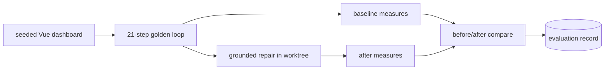

# InterfaceBench scenario, Vue dashboard evidence repair

> The golden longitudinal scenario for Motif v3.1: take a flawed Vue dashboard, ground the
> findings in the Evidence Graph, repair them in isolation, and measure the before/after.
> **Status: the deterministic measures run end-to-end; the browser-measured numbers are
> experimental and `not-executed` here** (no Playwright/browser). Mirrors
> [`docs/reviews/motif-v3-1-gap-analysis.md`](../reviews/motif-v3-1-gap-analysis.md). See the
> runner in [`README.md`](README.md).

## The scenario

A Vue 3 dashboard (`enterprise-app, dashboard` × `monitor, analyse` × `daily-operation, reporting, search-and-filter` × `domain-professional` × `keyboard, desktop, screen-reader` ×
`office`) seeded with realistic, evidence-addressable defects:

| Seeded defect | Grounding claim (example) | Detection | Repair |
|---|---|---|---|
| Status shown by colour only | `claim-status-not-colour-only` (Tier 1) | static heuristic **D** + runtime geometry **B** | add icon/text token |
| Missing keyboard focus states | `claim-visible-focus` (Tier 1, WCAG 2.4.7) | static **D** + browser **B** | restore focus-visible |
| Table with no empty/loading/error states | `claim-data-states-required` (Tier 2) | static **D** | add the missing states |
| Bulk delete with no confirm/undo | `claim-irreversible-action-confirm` (Tier 1) | static **D** + browser **B** | add confirm/undo |
| Over-dense filters justified by a myth | `myth-more-options-better` (warn) | model-review **D** | contextualise |

The pack [`pack-enterprise`](../ux-evidence/packs.md) supplies the grounded baseline and
`required_validations`.

## Pipeline



This is the [evidence-grounded repair loop](../improve/evidence-grounded-repair.md) executed as
a scored bench case. Findings with no supporting claim are dropped (step 12); the myth-justified
density is contextualised, not "fixed" (step 13).

## Metrics, model and deterministic kept separate

InterfaceBench never blends model judgement with deterministic measurement (mirrors the
runner's rule in [`README.md`](README.md)). The evaluation record reports two independent
columns:

### Deterministic measures (run here)

| Metric | Before | After | State |
|---|---|---|---|
| Findings grounded in a verified claim |, | all reported findings carry a claim id | `passed` |
| Unsupported findings dropped (not "fixed") |, | enforced (step 12) | `passed` |
| Required states present (loading/empty/error) | missing | present | `passed` |
| Confirm/undo on irreversible bulk action | absent | present (static evidence) | `passed` |
| Block-myth re-introduced by the repair |, | none | `passed` |
| Rollback reproduces the exact pre-repair tree |, | yes (git, deterministic) | `passed` |

### Browser-measured (experimental, `not-executed` here)

| Metric | State |
|---|---|
| axe-core violations before vs after | `not-executed` |
| Visible-focus confirmed in the running app | `not-executed` |
| Colour-only-status confirmed by runtime geometry | `not-executed` |
| Finding-closed verification in the live app | `not-executed` |
| Before/after screenshots in the report | `not-executed` |

The deterministic column proves the grounding, drop, plan, apply, rollback and report logic; the
browser column is held at `not-executed` until a browser CI run (per
[`ADR-UXE-001`](../adr/ADR-UXE-001-release-and-integration-strategy.md)).

## Running it

```bash
motif bench run --case vue-dashboard-evidence-repair          # deterministic measures
motif bench report --case vue-dashboard-evidence-repair       # before/after summary
motif bench rubric --case vue-dashboard-evidence-repair       # human rubric, scored by hand
```
Aliases `ii bench`, `oii bench`. Model-scored and human-rubric results are emitted separately
from the deterministic numbers and are never averaged together.

## Why this is the golden scenario

It exercises the whole v3.1 thesis in one case: a real framework app, a context vector resolved
per screen, claims grounding every change, hypotheses and myths handled correctly, an isolated
reversible repair, and an honest before/after report whose browser sections are clearly
`not-executed` rather than faked.
