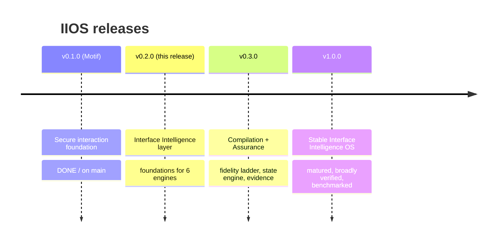

# Roadmap — Interface Intelligence OS

> Honest, capability-matrix-driven. Each release lists what is **implemented**,
> **experimental**, or **planned**. Status reflects `PROJECT_STATUS.md`, `PHASE_STATUS.md`,
> and ADR 0003. Nothing is marked done unless it passes `make check` and the honesty bar.

---

## v0.1.0 — Foundation (shipped as **Motif**, on `main`) — **implemented**

The validated secure interaction foundation. Carried forward unchanged as the Interaction
Intelligence Engine + Secure Component Supply Chain.

- Secure source supply chain; 5 static scanners; security policies — **implemented**
- Registry: ~90 sources, 64 components, 30 effects, 28 patterns, 14 recipes — **implemented**
- Transparent ranking; controlled installer (framework detection, dependency plan, scan,
  snapshot, rollback, provenance) — **implemented**
- Adapters + clean-room implementations (browser-native, Vue, Frappe-Vue, React, Svelte) —
  **implemented**
- 7 JSON Schemas; `make check` gate; CI — **implemented**
- Released and tagged (v0.1.0, v1.0.0); public repo. (`main` stays shippable as Motif.)

## v0.2.0 — Interface Intelligence layer (**this release**) — foundations

Goal per ADR 0003: build *functioning foundations* for the five new engines, evolving in
place on the `interface-intelligence-os` branch. Honest mix of statuses:

| Work | Target status this release |
|------|-----------------------------|
| Migration ADR 0003 + gap analysis | **implemented** |
| Research docs (methodology, ledger, competitive, problem, landscape) | **implemented** (this set) |
| `ii` CLI (primary) + `oii`/`motif` aliases | planned → in progress |
| Product Intelligence: Context Manifest (schema + example + validate) | planned (schema first) |
| Design Intelligence: styles/colour/typography/layout/UX-principles schemas + curated data | experimental |
| Product Design Genome (schema + extract/validate) | planned |
| Interaction Specification Graph (structured files + query) | experimental |
| Originality / Aesthetic-Convergence Detector (heuristics + audit) | experimental |
| Motion + Density grammars (data + validate) | experimental |
| State Completeness Engine (matrix + validate) | planned |
| Assurance evidence model (schema + static a11y/perf checks) | partial |
| Decision ledger (files + CLI) | planned |
| Interface debt + drift (heuristic score + CLI) | planned |
| Interface Specification Language (schema + parser + validator) | planned |
| Specialist agents (15, bounded roles) | planned |
| Root orchestrator SKILL.md (rewrite for the OS) | planned |
| InterfaceBench foundation (scenario + rubric) | planned |
| Adversarial + security evals (extend foundation) | partial |
| Capability matrix + honest README/docs | **implemented** (in progress) |

Definition of done for v0.2.0: each new engine has a real, validated foundation; the
capability matrix is the source of truth; `make check` stays green; nothing is overclaimed.

## v0.3.0 — Compilation + Assurance — **planned**

Turn foundations into enforced pipelines.

- **Compilation pipeline**: Context Manifest → Interaction Spec → fidelity ladder →
  framework-correct code, with the fidelity gate enforced.
- **State Completeness Engine** enforced at sign-off.
- **Assurance pipeline**: axe-core integration mapping findings to WCAG 2.2 SC; INP-aware
  performance budgets; motion/reduced-motion checks; recorded evidence with honest coverage
  statements; Storybook/Playwright emission where present.
- **Decision ledger + drift/debt** wired into the governance loop.
- **InterfaceBench** runnable with a published rubric.

## v1.0.0 — Stable Interface Intelligence OS — **planned**

- All six engines matured and integrated; the `ii` CLI is the primary, stable interface.
- Source landscape broadly verified (core ledger grown within the 15–25 band; candidates
  curated); volatile facts on a re-check cadence.
- InterfaceBench scores published reproducibly.
- Security model audited; assurance honest about coverage.
- Documentation, capability matrix, and examples complete; publication decision (repo rename
  vs new repo) made with human confirmation (deferred per ADR 0003).

---

## Cross-cutting commitments (every release)

- Dependency-free core; `make check` runs anywhere.
- Capability matrix kept truthful (implemented / experimental / planned).
- `main` remains shippable as Motif until the OS meets its own definition of done.
- No fabricated scale, benchmarks, or maturity.

> Dates are intentionally omitted: this is a sequence-and-readiness roadmap, not a
> commitment calendar. A release ships when it meets its definition of done.
