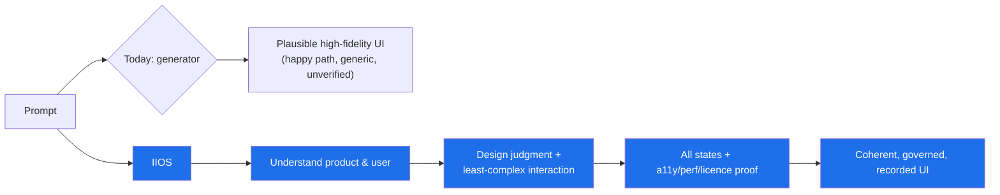

# Vision — Interface Intelligence OS

## The one-sentence vision

**Interface Intelligence OS (IIOS) is the open-source design-judgment, product-understanding,
interaction-engineering, implementation-assurance, and interface-governance layer that an AI
coding agent runs *through* — so the interfaces it produces are intentional, complete,
accessible, performant, licence-clean, and coherent over time.**

## The shift it makes

AI coding agents are now extremely good at *generating* UI. They are not good at the things
that separate a usable product from a plausible-looking screenshot: deciding what the user
actually needs, choosing the least-complex interaction that achieves it, covering every
state, meeting accessibility and performance bars, respecting licences, resisting the
generic "AI look", and keeping a system coherent across a long session.

IIOS moves the agent from **"generate something that looks right"** to **"reason from
product context to the simplest correct interface, prove it, and record why."** It is a
reasoning and governance system, not a component dump or a pile of animations.

## What "OS" means here

Not an operating system in the kernel sense — an **operating layer** for interface work:
a set of cooperating engines, a shared context model, deterministic tools, and a governance
loop that any agent can run on. It carries forward the validated **secure interaction
foundation** (registry, scanners, licence gate, controlled installer) shipped as Motif
v1.0.0, and surrounds it with five more engines.

## The six engines

1. **Design Intelligence** — styles, colour, typography, layout, UX principles; proposes
   distinctive-but-appropriate design instead of the modal default.
2. **Product Intelligence** — a Context Manifest and Product Design Genome: *who* the user
   is, *what* the product is, *what* must be understood/felt/accomplished.
3. **Interaction Intelligence** — the foundation: secure pattern/effect selection, the
   Interaction Specification Graph, and the least-complex-interaction rule.
4. **Implementation** — framework-neutral, own-your-source generation (browser-native, Vue,
   Frappe-Vue, React, Svelte) with a fidelity ladder and a compilation pipeline.
5. **Assurance** — state completeness, accessibility, performance, and motion verified with
   recorded evidence; honest about automated-coverage limits.
6. **Governance & Learning** — decision ledger, interface debt/drift, originality auditing,
   and the long-horizon coherence loop.

## Principles in one breath

Honesty over hype · least complexity that works · accessibility and reduced-motion are
mandatory · security and licensing are non-negotiable · framework neutrality with Vue and
Frappe-Vue first-class · deterministic tools for decisions, agents for judgment · every
decision recorded. (Full list: [`principles.md`](./principles.md).)

## What success looks like

- An agent using IIOS ships UI that **covers every state**, **passes accessibility and
  performance bars** (and says so honestly, including what it could not verify), and
  **does not look generically AI-generated**.
- A reviewer can open the **decision ledger** and see *why* each choice was made and what
  was rejected.
- No third-party code reaches a repo without passing the **licence and security gate**.
- Quality **does not degrade** over a long agent session — drift is detected and corrected.

## What it explicitly is *not*

An animation bundle, an effect-site list, a prompt that sprinkles motion, a single design
system, or "just another generator." See [`non-goals.md`](./non-goals.md).

## Honesty commitment

This vision describes the destination. The [roadmap](./roadmap.md) and the project
capability matrix mark every capability as **implemented**, **experimental**, or
**planned** — today only the secure interaction foundation is fully implemented. IIOS will
not claim a capability it has not built.
