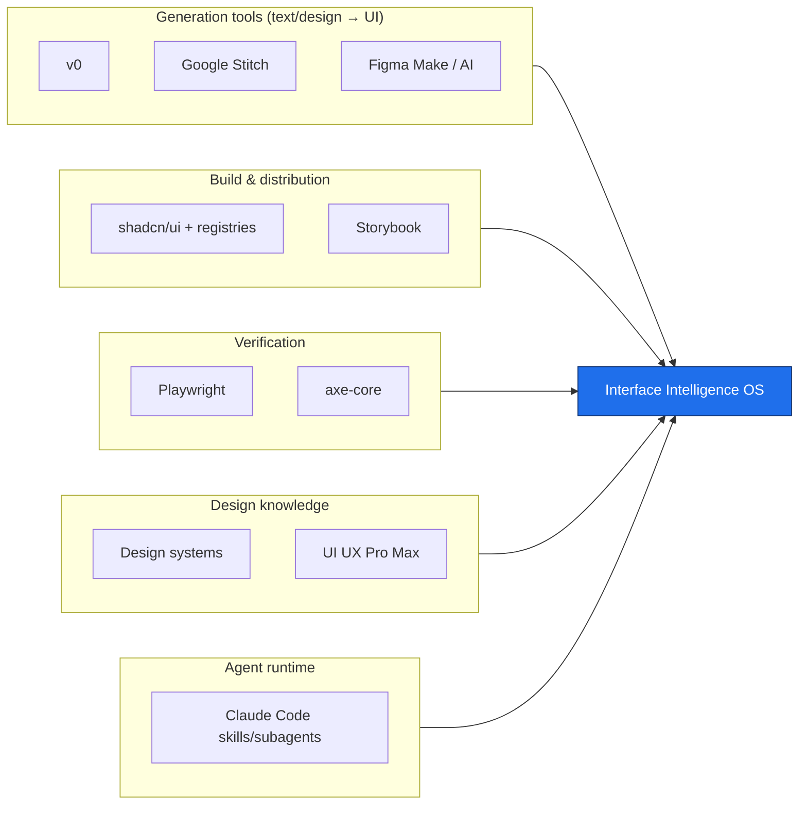

# Competitive & Comparable Landscape — Interface Intelligence OS

> The goal of this analysis is **not to attack** the tools below. Most of them are
> excellent at what they do, and IIOS reuses or interoperates with several of them. The
> goal is to locate the **layer IIOS occupies** — design judgment, product understanding,
> state/assurance discipline, and interface governance for AI coding agents — and to be
> honest about what is worth *importing* rather than recreating.
>
> Dates/facts are grounded against the [research ledger](./research-ledger.md). Where a
> claim is our reading rather than a vendor statement, it is marked *(inference)*.

---

## 0. The map in one picture

IIOS is not another generator. It is the **judgment, completeness, assurance and
governance layer** that sits *around* generation, build, and verification — deciding what
should be built, refusing what shouldn't, and recording why.

---

## 1. UI UX Pro Max (design-intelligence skill)

- **What it does well.** A large, well-organised UI/UX *knowledge pack* for agents:
  50+ styles, 160+ colour palettes, font pairings, product types, UX guidelines and chart
  types across many stacks. It is strong at giving an agent good defaults and vocabulary.
- **Architecture.** Skill/knowledge-base bundled for an agent runtime; curated data the
  agent reads on demand.
- **Source / data model.** Curated, opinionated catalogue (styles, palettes, pairings).
- **Framework coverage.** Broad (React, Next, Vue, Svelte, SwiftUI, RN, Flutter, Tailwind,
  shadcn, HTML/CSS).
- **Agent integration.** Native — designed as an agent skill.
- **A11y / security / licensing / validation / governance.** A11y appears as guideline
  content rather than enforced checks; no secure-ingestion or licence-gate model; no
  built-in validator or decision ledger *(inference, based on its described scope)*.
- **Gaps IIOS addresses.** Turns *knowledge* into *enforced judgment*: state-completeness,
  accessibility/performance assurance with evidence, originality/anti-convergence checks,
  secure supply chain, and a decision ledger.
- **Worth importing.** Its breadth of curated styles/palettes/pairings is a genuine asset;
  IIOS's Design Intelligence engine should interoperate with such curated data rather than
  re-deriving it.

## 2. Claude Code skills & subagents (agent runtime)

- **What it does well.** A clean mechanism for packaging expertise: **skills** are
  dynamically-loaded instruction folders that run in the main thread; **subagents** are
  isolated specialists with their own tools/context. Introduced/expanded through 2025.
- **Architecture.** Markdown + YAML-frontmatter files; orchestrator + specialists.
- **Agent integration.** It *is* the integration surface.
- **A11y / security / validation / governance.** Out of scope — it is a runtime, not a
  domain authority.
- **Gaps IIOS addresses.** IIOS provides the *domain content and guarantees* that ride on
  this runtime: the orchestrator skill, 15 bounded specialist agents, deterministic tools,
  and the governance loop.
- **Worth importing.** The pattern itself — orchestrator skill + bounded subagents +
  deterministic tools — is exactly how IIOS is delivered. IIOS builds *on* it, not against
  it. (See [ledger #17](./research-ledger.md).)

## 3. v0 (Vercel)

- **What it does well.** Best-in-class **prompt→production-React** generation: parses
  intent, plans a component tree, maps to shadcn primitives, streams TSX/JSX in a
  sandboxed Next.js preview, and supports conversational refinement. "Open in v0" +
  registries make branded components model-consumable.
- **Architecture.** Hosted generative-UI agent; shadcn/ui as default component system;
  shadcn registry format for distribution.
- **Source / data model.** shadcn registry + design-system registries.
- **Framework coverage.** React/Next-centric.
- **Agent integration.** Hosted product + registry/CLI (`npx shadcn add <v0 url>`).
- **A11y / security.** Relies on the quality of shadcn/Radix primitives for a11y *(strong
  baseline)*; supply-chain trust is the registry's; no independent licence gate or
  scanner on arbitrary imported registries *(inference)*.
- **Validation / governance.** Iteration loop is conversational; no formal
  state-completeness matrix, assurance evidence, or decision ledger *(inference)*.
- **Gaps IIOS addresses.** Premature high-fidelity output without an explicit
  fidelity-ladder; missing-states discipline; originality/anti-convergence; framework
  neutrality (Vue/Frappe-Vue first-class); auditable governance.
- **Worth importing.** The **shadcn registry format** as a model-consumable distribution
  contract, and the component-tree planning idea.

## 4. Google Stitch (Google Labs)

- **What it does well.** Multimodal **prompt/-image→UI + frontend code** using Gemini;
  AI-native infinite canvas; export to Figma and to dev tools. Fast ideation from text or
  sketches.
- **Architecture.** Hosted Labs experiment on Gemini 2.5 Pro.
- **Framework coverage.** Generates frontend code / Figma; not framework-governed.
- **A11y / security / validation / governance.** Not positioned as an
  accessibility/assurance or governance authority *(inference)*.
- **Gaps IIOS addresses.** Same fidelity-ladder, state-completeness, assurance, and
  governance gaps as other generators; plus IIOS is open-source and self-hostable.
- **Worth importing.** Multimodal sketch→structure ingestion is a strong *input* idea for
  Product Intelligence.

## 5. Figma Make / Figma AI (Config 2025)

- **What it does well.** **Design→code** with high fidelity to design intent; prompt a
  Figma file or phrase into a coded prototype; targeted edits via natural language.
  Deeply integrated with the design tool of record.
- **Architecture.** Inside Figma's design platform + AI.
- **A11y / security / validation / governance.** Design-tool-centric; not an enforced
  a11y/perf assurance layer or a governance ledger *(inference)*.
- **Gaps IIOS addresses.** The handoff from "looks right in Figma" to "is accessible,
  performant, state-complete and licence-clean in code" — exactly IIOS's assurance scope.
- **Worth importing.** Design-intent preservation and the DTCG token bridge (Figma is a
  DTCG adopter — see [ledger #6](./research-ledger.md)).

## 6. shadcn/ui + registries

- **What it does well.** Not a library but a **toolkit you own the source of**: copy-in
  components over Radix primitives, distributed via a model-friendly **registry format**.
  Excellent agent ergonomics; strong a11y baseline via Radix.
- **Architecture.** CLI + registry JSON; code lands in your repo.
- **Source / data model.** Registry items (files, deps, metadata).
- **A11y.** Strong (Radix/React Aria lineage). **Security.** Registry trust is the user's
  responsibility — arbitrary third-party registries are unsanitised by default *(inference;
  this is the exact risk IIOS's ingestion pipeline addresses)*.
- **Gaps IIOS addresses.** Secure ingestion + scanning + licence gate over arbitrary
  registries; judgment about *whether* a component fits the product context; assurance.
- **Worth importing.** The **registry format** (IIOS already speaks it) and the
  own-your-source philosophy — clean-room/adaptable implementations rather than runtime
  black boxes.

## 7. Storybook

- **What it does well.** Component workbench with **interaction tests** (play functions)
  and an **a11y addon built on axe-core** (catches up to ~57% of WCAG issues); visual and
  test-runner integration.
- **Architecture.** Dev-time component explorer + addons + CI test runner.
- **A11y / validation.** First-class — this is a model for *how* IIOS assurance should
  plug into a dev workflow.
- **Gaps IIOS addresses.** Storybook verifies what you *built*; IIOS governs *what to
  build* and enforces **state completeness** before code (states as a spec, not just
  stories an author remembered to write).
- **Worth importing.** The play-function interaction-test pattern and axe-core integration
  (see [ledger #5, #16](./research-ledger.md)). IIOS should emit Storybook stories/tests as
  an assurance output where Storybook is present.

## 8. Playwright

- **What it does well.** Reliable cross-browser **E2E + component testing**, tracing,
  and `@axe-core/playwright` for automated a11y assertions in CI.
- **Architecture.** Browser-automation test runner.
- **Gaps IIOS addresses.** Playwright is an *execution* substrate; IIOS supplies the
  *what to assert* (state matrix, a11y/perf/motion budgets) and records evidence.
- **Worth importing.** Use Playwright as the assurance execution engine rather than
  building a runner — wrap, don't recreate.

## 9. axe-core

- **What it does well.** The **global standard** automated a11y engine (MPL‑2.0, Deque),
  ~90 rules across WCAG 2.0/2.1/2.2 A–AAA, explicit "incomplete"/manual-review signalling,
  enormous adoption.
- **Honesty it models.** It openly states it catches only ~57% of issues — the same
  intellectual honesty IIOS requires of its own assurance claims.
- **Gaps IIOS addresses.** axe checks rendered DOM; IIOS adds *design-time* a11y judgment,
  motion/reduced-motion, target-size and state coverage, and ties findings to evidence.
- **Worth importing.** Use axe-core directly as the a11y rule engine; map each finding to a
  WCAG SC in the assurance evidence model.

## 10. Design systems (Material, Carbon, Fluent, Polaris, Primer, Spectrum, Atlassian, Ant)

- **What they do well.** Decades of accumulated, opinionated design judgment: tokens,
  components, motion, accessibility guidance, content style.
- **Source / licensing — the nuance IIOS lives on.** Code and guidance/assets often carry
  **different** terms: Polaris is *modified-MIT with a field-of-use restriction*; Salesforce
  SLDS splits BSD‑3 code from CC‑BY‑NC‑ND assets; Material/Apple HIG guidance is
  reference-only; Carbon/Fluent/Primer code is permissive but brand/assets are reserved
  (all recorded in `registry/sources/`).
- **Gaps IIOS addresses.** No single system is product-agnostic or agent-native, and their
  licences are easy to violate by copying assets with code. IIOS's licence gate and
  `adaptable-concept` vs `redistributable` dispositions are designed precisely for this.
- **Worth importing.** Their *principles and token structures* (via DTCG) as design
  intelligence — as guidance, honouring each system's terms; never bulk-copying assets.

## 11. "Agent-ready design systems" (emerging)

- **What they do well.** Design systems exposing **machine-consumable** registries/MCP so
  agents emit on-brand, on-system UI (the direction v0 design-systems, shadcn registries,
  and Figma/DTCG MCP point toward).
- **Gaps IIOS addresses.** Agent-readiness solves *distribution*, not *judgment*: it does
  not by itself prevent premature fidelity, missing states, convergence, or licence drift,
  nor does it govern long-horizon quality. IIOS is the governance/assurance layer that
  consumes agent-ready systems safely.
- **Worth importing.** The contract direction itself — IIOS treats DTCG tokens and the
  shadcn registry format as first-class interop surfaces.

---

## Where IIOS sits (synthesis)

| Capability | Generators (v0/Stitch/Figma) | shadcn + registries | Storybook/Playwright/axe | Design systems | **IIOS** |
|------------|:--:|:--:|:--:|:--:|:--:|
| Generate UI fast | ✅ | ➖ | ✗ | ➖ | ➖ (delegates) |
| Own-your-source components | ➖ | ✅ | ✗ | ➖ | ✅ (clean-room/adapt) |
| Verify a11y/interaction | ➖ | ✗ | ✅ | ➖ | ✅ (wraps them) |
| Decide *what to build* (product judgment) | ✗ | ✗ | ✗ | ➖ | ✅ |
| Enforce state completeness | ✗ | ✗ | ➖ | ✗ | ✅ |
| Resist generic-AI convergence | ✗ | ✗ | ✗ | ➖ | ✅ (originality engine) |
| Secure ingestion + licence gate | ✗ | ✗ | ✗ | ➖ | ✅ |
| Decision ledger + drift/debt governance | ✗ | ✗ | ✗ | ✗ | ✅ |
| Framework-neutral (Vue/Frappe-Vue first-class) | ➖ | ➖ | ✅ | ➖ | ✅ |

Legend: ✅ strong · ➖ partial/indirect · ✗ not a goal. Generator/registry cells reflect
*positioning*, not quality — these are excellent tools IIOS is built to cooperate with.

**Bottom line.** The market is crowded at *generation* and maturing at *distribution* and
*verification*. It is thin at **judgment, completeness, originality, and governance for
agents** — and that is the layer IIOS adds, while importing (not recreating) the registry
format, axe-core, Playwright, Storybook patterns, DTCG tokens, and curated design knowledge.
