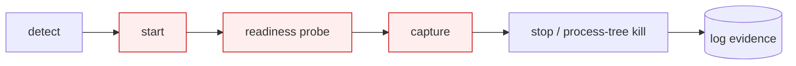
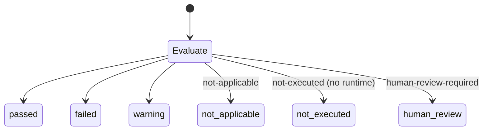

# Browser assurance, app runner + capture pipeline

> Part of Motif v3.1. **Status: the orchestration logic is implemented and deterministic; every
> step that drives a real browser is experimental and `not-executed` in this environment**
> (`pip` is broken, so Playwright + a browser cannot be installed or run). Mirrors
> [`docs/reviews/motif-v3-1-gap-analysis.md`](../reviews/motif-v3-1-gap-analysis.md) and
> [`ADR-UXE-001`](../adr/ADR-UXE-001-release-and-integration-strategy.md). See also the
> v3 runtime overview in [`README.md`](README.md).

## The app runner

The app runner brings a target interface up safely so its live behaviour can be observed, then
tears it down cleanly. It is exposed as `motif app …` (aliases `ii app`, `oii app`) and is used
by the evidence-grounded repair loop.

```bash
motif app detect   --target ./app     # framework, start/build commands, routes (static, runs here)
motif app start    --target ./app     # EXPERIMENTAL: start + readiness wait (needs a runtime)
motif app stop     --target ./app     # process-tree kill (logic implemented)
motif doctor --browser                # honest availability check
```



| Stage | What it does | Status |
|---|---|---|
| **detect** | identify framework, start/build command, routes | implemented (static) |
| **start** | launch the app in an isolated git worktree | experimental, cannot start the fixture here (no `node_modules`, no browser) |
| **readiness** | probe until the server responds or time out | experimental (not-executed) |
| **capture** | drive the browser, collect artifacts | experimental (not-executed) |
| **stop** | terminate the whole process tree (no orphans) | implemented (deterministic) |
| **log evidence** | persist stdout/stderr + run record | implemented |

Safety: live process start is the one genuinely risky action. It is mitigated by **git worktree
isolation** (never the user's branch or `main`), an explicit opt-in flag, and a process-tree
kill on stop. Browser-dependent stages return `not-executed` rather than fabricating results.

## The capture pipeline

When a runtime is available (not here), capture collects, per screen/state, the artifacts
described in [`../ux-evidence/browser-integration.md`](../ux-evidence/browser-integration.md):
screenshot, axe-core scan, a11y tree snapshot, console messages, network requests, trace and
element geometry. These become evidence attached to findings and to the before/after report.

## The six result states

Every assurance check, static or browser, resolves to exactly one of six states. This is how
the system stays honest: a browser check that could not run is **`not-executed`**, never a
silent pass.

| State | Meaning |
|---|---|
| `passed` | the check ran and the criterion was met |
| `failed` | the check ran and the criterion was not met |
| `warning` | ran; a non-blocking concern was found |
| `not-applicable` | the check does not apply to this context (e.g. no touch target on a desktop-only flow) |
| `not-executed` | the check could not run (e.g. no browser runtime), **the status of all browser checks here** |
| `human-review-required` | automation cannot decide; a person must judge (e.g. subjective clarity, an unresolved conflict) |



Reports and run records carry the state per check, so a reader can always distinguish "we
checked and it's fine" from "we couldn't check." In this environment, the browser-driven checks
of the golden loop are reported `not-executed`; the deterministic checks report
`passed`/`failed`/`warning`/`not-applicable` normally.

## Relationship to the Evidence Graph

A claim's `validation.methods` (the `val-…` records) decide which assurance checks a fix must
pass. The runner executes the static ones and, when available, the browser ones; the resulting
six-state outcomes are written back as assurance evidence and compared before/after.
