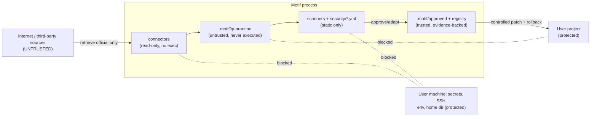

# Threat Model

Motif deliberately operates in a dangerous space: "discover an effect on the web" naturally
tempts a system into scraping arbitrary sites and executing untrusted third-party code
inside a user's project. The architecture exists to make that the **hard path, not the
easy one**. This document records the assets, trust boundaries, attacker goals, the
controls that mitigate them, and the residual risk.

## Assets to protect

- **The user's project**, source tree, build pipeline, deployed application.
- **The user's machine**, secrets, SSH keys, GitHub credentials, environment variables,
  home-directory files, local network.
- **The Motif registry's integrity**, only safe, licence-clear, evidence-backed records
  should ever reach `approved`.
- **Licence compliance**, the user must not unknowingly redistribute restricted code.
- **The end user of the built product**, must not receive exfiltrating, tracking or
  malicious client-side code.

## Trust boundaries

Key boundaries:

- **Internet → quarantine.** Crossing it requires an explicit source-refresh; default
  mode is offline. Connectors retrieve from approved official locations only.
- **Quarantine → approved.** Crossing requires passing static scans, the licence gate,
  dependency inspection and behaviour review. **No execution** happens on this side of
  the boundary.
- **Approved → project.** Crossing requires a controlled installation: diff preview,
  rollback snapshot, validation, and a provenance manifest. Third-party installers are
  never run directly against the target project.
- **Everything → host secrets.** Always denied. No layer reads SSH keys, GitHub
  credentials, env vars or home-directory files.

## Attacker goals and how Motif frustrates them

### 1. Remote code execution via install/lifecycle scripts

*Goal:* get `npm install`, a `postinstall` lifecycle script, or shell-from-docs to run on
the user's machine.

*Controls:* **No execution during ingestion**, connectors must not run install scripts,
execute JavaScript, run shell commands from documentation, or open binaries. Dependency
inspection flags `lifecycle scripts`. Controlled installation never runs third-party
installers against the target; it applies a reviewed patch with rollback. When execution
is genuinely required it occurs in a disposable sandbox (no secrets, no host network, no
SSH/GitHub creds, no home mount, CPU/memory/timeout limits, ephemeral read-only base).

### 2. Data exfiltration in shipped effect code

*Goal:* hide a `fetch`/WebSocket beacon, telemetry, cookie/storage/clipboard access, or
remote script loading inside an "effect" so it runs in the end user's browser.

*Controls:* the **behaviour scanner** and browser-behaviour/network policies flag
undocumented `fetch`/XHR/WebSocket, cookie access, local/session storage, clipboard,
service workers, camera/microphone/geolocation, iframe injection, unsafe HTML insertion,
analytics/telemetry, and remote script injection. An ordinary effect requires none of
these; any such behaviour needs explicit justification and approval or is quarantined/
rejected.

### 3. Licence laundering

*Goal:* slip source-available, Commons-Clause, paid or attribution-required code into a
permissive-looking bundle.

*Controls:* the **licence gate**, **unknown licence ⇒ `reference-only`, never bundled.**
Public visibility is not redistribution permission. Source-available/Commons-Clause terms
are never treated as ordinary permissive open source. The project's MIT licence never
overrides third-party obligations. Premium/paid components are never copied or
reconstructed from previews. Restricted sources go through **clean-room adaptation** that
retains no source code.

### 4. Supply-chain compromise

*Goal:* pull a typosquatted/abandoned/compromised dependency, or smuggle in transitive
dependencies with their own lifecycle scripts.

*Controls:* the **dependency scanner** inspects direct, transitive, peer and optional
dependencies, lifecycle scripts, maintainer/package identity, typosquatting risk,
deprecation, unresolved advisories, unexpected dependency growth and licence
compatibility. The **no-automatic-new-dependency** rule prefers dependency-free
implementation → existing project dependency → original internal recipe → approved
lightweight dependency → heavier dependency only with clear justification.

### 5. Tampered or spoofed source

*Goal:* serve different bytes than the reviewed ones, or impersonate an official source
via a redirect/shortener/IP host.

*Controls:* **official source verification** (tagged release > registry > pinned commit >
webpage last resort), **pinning + integrity** (version, tag, commit hash, retrieval date,
SHA-256 checksum), and the **domain policy** (explicit allowlist; block unknown
redirects, URL shorteners, IP-address URLs, localhost, private network ranges, unapproved
asset hosts).

### 6. Secret leakage

*Goal:* exfiltrate or accidentally commit embedded secrets.

*Controls:* the **secret scanner** flags embedded secrets in quarantined material, and
the release process runs a secret scan on a clean checkout. Motif never prints or stores
tokens, SSH keys or private configuration.

## STRIDE-ish control mapping

| Threat type | Primary Motif control | Component |
|-------------|---------------------|-----------|
| **Spoofing** (fake source/domain) | Official source verification, domain allowlist | `security/*.yml`, connectors |
| **Tampering** (altered code) | Version/commit pinning + SHA-256 checksum | ingestion, `source_scanner` |
| **Repudiation** (no provenance) | Provenance manifest per install; evidence per record | installation, registry |
| **Information disclosure** (exfiltration/secrets) | Behaviour + network + secret scanners; host-secret denial | `behaviour_scanner`, `secret_scanner` |
| **Denial of service** (mining/jank) | Crypto-mining pattern detection; performance budgets | `behaviour_scanner`, quality profiles |
| **Elevation of privilege** (RCE) | No execution during ingestion; sandbox; rollback | connectors, `dependency_scanner` |
| **Licence/legal** (laundering) | Licence gate; clean-room adaptation | `license_scanner`, governance |

The static scanners live in `scanners/` (`source_scanner`, `dependency_scanner`,
`license_scanner`, `behaviour_scanner`, `secret_scanner`); their thresholds and
allow/deny lists live in `security/*.yml`. Malicious fixtures exercise the controls so a
regression that weakens a scanner is caught by tests.

## Defence in depth

No single control is trusted. A piece of code must clear *all* relevant gates, official
verification, checksum pinning, static scan, dependency inspection, behaviour
classification, licence gate, accessibility/performance review, before it can be
approved, and it still only reaches a project through a reversible, manifested install.

## Residual risk

Static analysis and policy gates **reduce risk substantially but cannot guarantee that
third-party code is completely safe.** Obfuscation can hide intent from static scanners;
a legitimate-looking dependency can be compromised upstream after review; a licence can
be misread; novel attack patterns may not yet have a detection rule. Motif's mitigations
are: prefer original and browser-native implementations, keep the offline registry the
default, require human review of every flagged finding (not every occurrence is
malicious, but every flagged occurrence must be reviewed), pin and checksum everything,
and make every installation reversible with a provenance trail. Users and reviewers
should treat approval as "passed our gates," not "proven safe," and apply their own
judgement for high-stakes projects.
