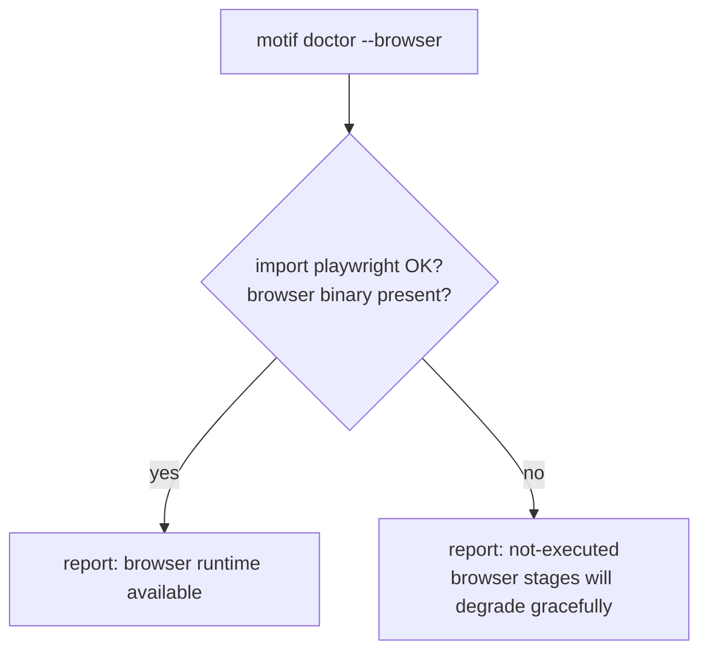

# Browser integration (experimental / not-executed)

> **Status: experimental, not executed in this environment.** `pip` is non-functional here (a
> Homebrew libexpat/pyexpat ABI mismatch), so Playwright and a browser **cannot be installed or
> run**. Every browser-executed capability on this page is built as real code behind an optional
> extra and reported `not-executed`. No browser result is ever fabricated. This mirrors
> [`docs/reviews/motif-v3-1-gap-analysis.md`](../reviews/motif-v3-1-gap-analysis.md) and
> [`ADR-UXE-001`](../adr/ADR-UXE-001-release-and-integration-strategy.md).

## The optional extra

Browser execution is an **optional install extra**, never a base dependency:

```bash
pip install "motif[browser]"     # Playwright + axe-core  (cannot run here)
python -m playwright install      # browser binaries        (cannot run here)
```

The base CLI, `make check`, the Evidence Graph and the deterministic repair/report path all run
**without** this extra. `ii/browser.py` is a clean abstraction: it uses Playwright when it is
importable, and otherwise returns a structured `not-executed` result rather than raising or
pretending.

## `motif doctor --browser`

```bash
motif doctor --browser
```

Honestly reports whether a browser runtime is present. In this environment it reports the extra
and browser binaries as **unavailable**, and the golden loop's browser stages as
`not-executed`, it does not claim assurance it cannot perform.



## What the browser path captures (when available)

When the extra is installed and a runtime exists, `ii/browser.py` captures evidence artifacts
per screen/state. **All marked experimental / not-executed here:**

| Artifact | Purpose |
|---|---|
| Screenshot (per state) | before/after visual evidence |
| axe-core scan | accessibility violations as findings |
| Accessibility (a11y) tree snapshot | structural a11y evidence |
| Console messages | runtime errors/warnings |
| Network requests | failed/slow request evidence |
| Trace | step-level replay |
| Element geometry | runtime-only checks (e.g. colour-only-status, target size) that static analysis cannot prove |

These feed the evidence-grounded repair loop's **observe**, **validate** and **compare** stages
(see [`../improve/evidence-grounded-repair.md`](../improve/evidence-grounded-repair.md)) and the
browser assurance pipeline ([`../runtime/browser-assurance.md`](../runtime/browser-assurance.md)).

## Static vs browser detection

A claim's `detection` block declares which channels can find a violation: `static`, `browser`,
`model_review`, `human`. The query engine uses this to route checks:

- **static** detections run here and now (deterministic).
- **browser** detections are attempted only when the extra is present; otherwise they return
  `not-executed` and any claim relying *solely* on browser detection is reported as unverified
  rather than passed. For example, colour-only-status detection has a static heuristic (runs
  here) **and** a runtime-geometry confirmation (experimental, not-executed).

## Honesty gate on tagging

Per `ADR-UXE-001`, v3.1.0 is **not tagged** until a separate browser CI job runs the golden loop
successfully. That job cannot run in this environment, so the deterministic work is completed and
validated and the release is held with browser steps reported `not-executed`. Browser tests are a
separate CI job, never part of the dependency-free `make check`.
