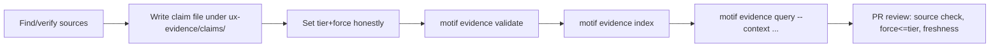

# Authoring an evidence claim

> The authoritative schema is
> [`ux-evidence/schemas/evidence-claim.schema.json`](../../ux-evidence/schemas/evidence-claim.schema.json)
> (draft-07). Claims live as one file each under [`ux-evidence/claims/`](../../ux-evidence/claims/).
> This page documents the fields and the workflow.

## The claim schema

A claim file has eight required top-level keys: `id`, `schema_version`, `claim`,
`applicability`, `evidence`, `detection`, `validation`, `freshness`. Optional:
`recommendation`, `repair`, `legal`.

| Field | Required | Meaning |
|---|---|---|
| `id` | yes | `^claim-[a-z0-9-]+$`, stable and unique |
| `schema_version` | yes | integer; bump on schema-shape changes |
| `claim.statement` | yes | one sentence, falsifiable |
| `claim.category` | yes | grouping string (e.g. `accessibility`, `forms`, `feedback`) |
| `claim.type` | yes | `requirement, recommendation, principle, anti-pattern` |
| `claim.force` | yes | `normative, strong-recommendation, contextual-recommendation, hypothesis` |
| `applicability.*` |, | arrays over the 9 ontology dimensions + `jurisdiction`; **empty/absent = applies broadly** within its category |
| `evidence.tier` | yes | 1-6 (see [`evidence-tiers.md`](evidence-tiers.md)) |
| `evidence.sources` | yes | array of `src-…` ids in [`ux-evidence/sources/`](../../ux-evidence/sources/) |
| `evidence.confidence` | yes | authored *floor* `high·medium·low`; the engine may only lower it |
| `evidence.methodology` / `evidence.limitations` |, | how it was found; what it does not cover |
| `recommendation.do` / `recommendation.avoid` |, | actionable guidance |
| `detection.static, browser, model_review, human` |, | how a violation is detected (`browser` ⇒ experimental, see below) |
| `repair.automatable` (`none·partial·full`), `approval_required`, `strategies` |, | how Improve may fix it |
| `validation.methods`, `automatable`, `requires_human_eval`, `metrics` |, | how a fix is proven |
| `legal.compliance_claim_allowed`, `disclaimer_required` |, | guardrails (see [`legal-and-copyright.md`](legal-and-copyright.md)) |
| `freshness.status` | yes | `current, stale, deprecated` |
| `freshness.published_at, reviewed_at, review_after` |, | ISO dates driving decay |

`additionalProperties: false`, unknown keys fail validation.

## Worked example

```yaml
# ux-evidence/claims/claim-irreversible-action-confirm.yml
id: claim-irreversible-action-confirm
schema_version: 1
claim:
  statement: >-
    Irreversible or financially consequential actions must require an explicit confirmation
    or provide an undo window before the effect is committed.
  category: safety
  type: requirement
  force: normative
applicability:
  risks: [financial, irreversible, legal]
  purposes: [transact, comply]
  audience_roles: [beneficiary, operator]
evidence:
  tier: 1
  sources: [src-wcag-3-3-4, src-nngroup-undo]
  methodology: [standards-review, empirical-synthesis]
  confidence: high
  limitations:
    - "Applies to consequential actions; do not gate trivial reversible actions (myth-confirm-everything)."
recommendation:
  do:
    - "Use a confirmation step OR a time-boxed undo for consequential actions."
    - "State the consequence plainly in the confirmation."
  avoid:
    - "Confirming every routine, reversible action."
detection:
  static: true
  browser: true        # EXPERIMENTAL: runtime detection of the confirm/undo affordance
  model_review: true
repair:
  automatable: partial
  approval_required: true
  strategies: [add-confirm-dialog, add-undo-toast]
validation:
  methods: [val-axe-scan, val-task-completion]
  automatable: partial
  requires_human_eval: false
  metrics: [error-rate, accidental-commit-rate]
legal:
  compliance_claim_allowed: false
  disclaimer_required: true
freshness:
  published_at: "2026-06-28"
  reviewed_at: "2026-06-28"
  review_after: "2027-06-28"
  status: current
```

## How to add a claim



1. **Add or reuse sources** in `ux-evidence/sources/` with a `verification_status`. A claim may
   not cite a source that does not exist.
2. **Write the claim file**. Keep `claim.statement` falsifiable; set `applicability` to the real
   slice, not "everything".
3. **Set `tier` and `force` honestly.** Force may not exceed what the tier supports (review
   rejects e.g. `normative` on Tier 5).
4. **Validate** against the schema: `motif evidence validate` (aliases `ii`/`oii`). This is part
   of `make check` and is dependency-free.
5. **Rebuild indexes**: `motif evidence index` regenerates [`ux-evidence/indexes/`](../../ux-evidence/indexes/).
6. **Smoke-query**: `motif evidence query --context examples/dashboard.json` to see how it
   resolves and conflicts (see [`query-engine.md`](query-engine.md)).
7. **Open a PR.** Review checks: sources verified, tier↔force consistent, applicability not
   over-broad, freshness dates present, legal guardrails set.

## Freshness and review

- `published_at` / `reviewed_at` / `review_after` are ISO-8601 dates.
- When `now > review_after`, the claim is **due for review**; until re-reviewed its derived
  confidence is reduced and it **cannot newly block** (it decays toward `stale`).
- Set `status: deprecated` to retire a claim without deleting history; deprecated claims never
  contribute to blocks or warnings, only to provenance.

See [`confidence.md`](confidence.md) for exactly how freshness lowers confidence.
