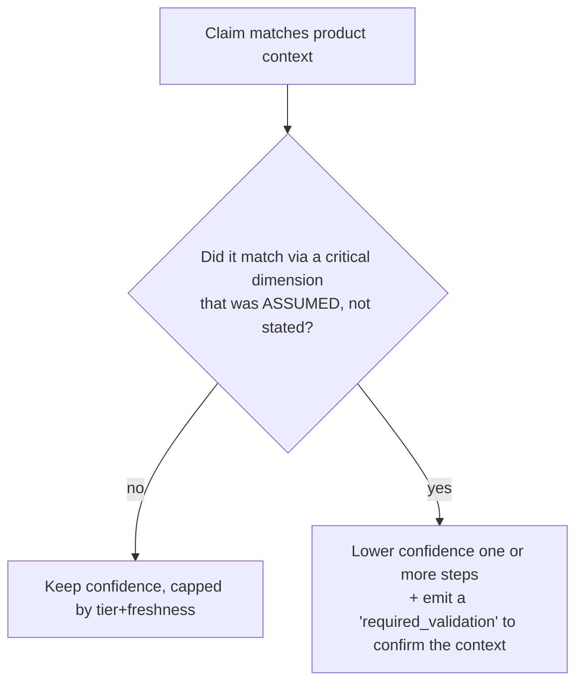

# Confidence, derived, not asserted

> Confidence is the answer to "how much should we trust this claim *for this product, right
> now*?" It is **computed at query time**, never taken at face value from the claim file.

## Why derived

A claim file carries `evidence.confidence` (`high, medium, low`), but that value is only a
**ceiling/floor the author vouches for**, it is the most the claim may ever present. The query
engine recomputes an **effective confidence** for each match and may only ever **lower** it,
never raise it. This prevents an author from asserting "high" into existence and keeps the
number tied to the actual situation: the evidence tier, the freshness, and whether the context
that made the claim apply was *known* or *assumed*.

```
effective_confidence = lower_of(
    authored_confidence,
    tier_ceiling(evidence.tier),
    freshness_factor(freshness),
    context_assumption_factor(matched dimensions)
)
```

## What lowers confidence

### 1. Tier ceiling
A low tier caps confidence regardless of the authored value. Tier 5-6 evidence cannot present
as `high`; it is hypothesis-grade (see [`evidence-tiers.md`](evidence-tiers.md)).

### 2. Staleness (the freshness factor)
- `current` and within `review_after` → no reduction.
- Past `review_after` (due for review) → one step down (`high`→`medium`).
- `stale` → reduced and **may not newly block**.
- `deprecated` → does not contribute at all.

This is the "stale claims lose confidence" rule made concrete, and it is the same fact the
merge engine uses to enforce "stale cannot newly block" (merge rule 8).

### 3. Critical context evaluated as an assumption
This is the most important reduction. The Product Context Manifest marks each dimension of the
context vector with a **provenance**: `stated` (the user/repo told us) or `assumed` (Motif
inferred it). When a claim applies **only because of an assumed dimension**, especially a
*critical* one (risk, abilities, expertise), the effective confidence is **lowered**, because
the very thing that made the claim relevant is itself uncertain.



Example: a strict `screen-reader` claim matches because Motif *assumed* `abilities:
[screen-reader]` for a public-service form. The recommendation still surfaces, but at reduced
confidence and accompanied by a required validation to confirm the audience, not silently
asserted as certain.

## What confidence does NOT change

- It does **not** flip blocking. Blocking is governed by tier + force + verification + freshness
  (see [`evidence-tiers.md`](evidence-tiers.md)). A high-confidence Tier-5 hypothesis still
  cannot block; a reduced-confidence verified Tier-1 normative rule still blocks.
- It does **not** get rounded up. The engine exposes the reductions and their reasons in the
  query result so consumers (Studio, MCP) can show *why* confidence is what it is.

## Surfaced, not hidden

Every query result carries, per applicable claim, the effective confidence **and** the reasons
it was lowered (`tier-ceiling`, `stale`, `assumed-critical-context`). Merge rule 10 ("expose
sources and limitations") guarantees this is visible rather than collapsed into a single
opaque score.
