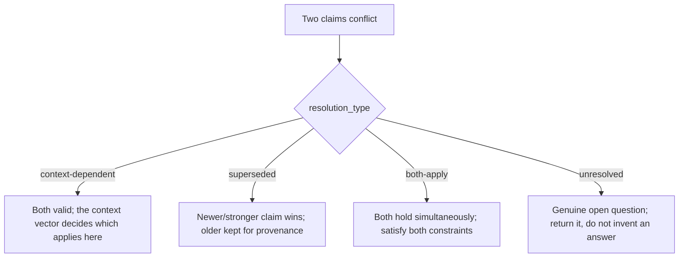

# Contradictions

> Real UX evidence disagrees. The Evidence Graph does not paper over that, it records
> disagreements as first-class `contradiction` records and returns the *unresolved* ones to the
> caller rather than silently picking a side. Schema:
> [`ux-evidence/schemas/contradiction.schema.json`](../../ux-evidence/schemas/contradiction.schema.json).
> Records live in [`ux-evidence/contradictions/`](../../ux-evidence/contradictions/).

## The contradiction schema

| Field | Required | Meaning |
|---|---|---|
| `id` | yes | `^contradiction-[a-z0-9-]+$` |
| `topic` | yes | what the disagreement is about (e.g. "infinite scroll vs pagination") |
| `competing_claims` | yes | array of `claim-…` ids that pull in different directions |
| `resolution_type` | yes | `context-dependent, superseded, unresolved, both-apply` |
| `resolution` |, | the rule, when there is one |
| `unresolved` |, | the questions that remain open |
| `human_decision_required` |, | boolean; if true, the engine will not auto-resolve |

## The four resolution types

- **context-dependent**, the most common. The claims don't actually conflict once you fix the
  context vector (e.g. density guidance differs for `novice` vs `expert`). The query engine's
  specificity rule resolves these automatically; the contradiction record documents *why*.
- **superseded**, a newer or higher-tier claim replaces an older one. The old claim is kept for
  history but does not contribute; this is also reflected by setting the old claim's freshness to
  `deprecated`.
- **both-apply**, both constraints are real and must *both* be satisfied (e.g. "high
  information density" and "WCAG target size" are both binding; the answer is a layout that
  honours both, not a choice between them).
- **unresolved**, the evidence genuinely conflicts and there is no defensible rule yet. The
  engine returns it in the result's `conflicts` array and, if `human_decision_required: true`,
  refuses to auto-pick.

## How the query engine treats them

Per the merge rules (see [`query-engine.md`](query-engine.md)):

- A contradiction whose `resolution_type` resolves under the current context vector is applied
  silently per the specificity / normative / risk rules.
- An **unresolved** contradiction (or any with `human_decision_required: true`) is surfaced in
  the result's `conflicts` list with both competing claims, their tiers and their sources, it
  is **never** collapsed into one recommendation. This is merge rule 6: "real conflicts are
  returned, not hidden."
- Resolving a conflict never lets a weaker claim override a normative one (merge rule 3), and a
  hypothesis-grade claim cannot create a blocking conflict (merge rule 7).

## Authoring a contradiction

1. Identify the two (or more) `claim-…` ids that pull apart.
2. Decide the honest `resolution_type`. If you can't, it's `unresolved`, say so.
3. If context-dependent, ensure each competing claim's `applicability` actually encodes the
   distinguishing dimension, so the engine can resolve it automatically.
4. Set `human_decision_required: true` for high-stakes topics (safety, legal) where you don't
   want silent resolution.
5. `motif evidence validate` and re-index.

The goal is intellectual honesty: where the field disagrees, the tool says so.
