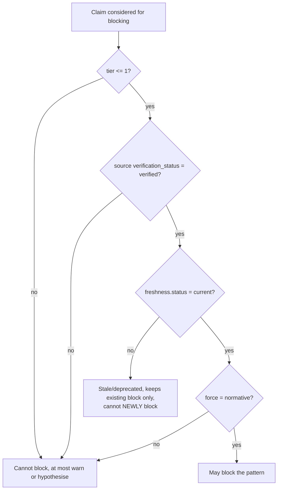

# Evidence tiers (1-6)

> Every claim and every source carries an integer `tier` from 1 to 6 (see the `evidence.tier`
> field in [`ux-evidence/schemas/evidence-claim.schema.json`](../../ux-evidence/schemas/evidence-claim.schema.json)
> and `tier` in [`source.schema.json`](../../ux-evidence/schemas/source.schema.json)). The tier
> answers "how was this known?" and it governs what the claim is *allowed to do* in a merge.

## The tiers

| Tier | Kind of evidence | Example sources | What it may do |
|---|---|---|---|
| **1** | Normative standard / specification, verified | WCAG success criteria, platform HIG hard requirements, law-derived UI rules | **May block** (normatively) when verified and current |
| **2** | Strong empirical research, replicated | Peer-reviewed studies, large-n usability research with disclosed method | Strong recommendation; may block only if also a verified normative rule |
| **3** | Single credible study / authoritative practitioner synthesis | One reputable study, well-sourced industry research with method disclosed | Contextual recommendation |
| **4** | Established convention / pattern consensus | Widely documented design-system conventions, convergent practice | Contextual recommendation, lower confidence |
| **5** | Expert opinion / heuristic | Named practitioner heuristics, principled argument without measurement | **Hypothesis only**, may not block |
| **6** | Anecdote / unverified assertion | Blog claims, forum lore, "everyone knows" | **Hypothesis only**, may not block; usually feeds the [myth register](myths.md) |

## The blocking rule

- **Normative blocking requires a verified Tier 1 claim** that is `current`. Nothing weaker may
  hard-block a change.
- **Tier 5-6 only create hypotheses.** They surface as *required validations* or warnings, never
  as blocks. The engine guarantees "hypotheses never block" (merge rule 7).
- **Stale claims lose confidence and cannot newly block.** A claim whose `freshness.status` is
  `stale` or `deprecated` has its confidence reduced and may not introduce a *new* block; it may
  only continue an already-established normative block until re-reviewed. (See merge rule 8 in
  [`query-engine.md`](query-engine.md) and decay in [`confidence.md`](confidence.md).)

## Tier vs force vs confidence, three different things

- **Tier** = quality/kind of the *evidence*. Set when authoring, from the source.
- **Force** = `normative, strong-recommendation, contextual-recommendation, hypothesis`, the
  *intent* of the claim. A Tier-1 verified rule is usually `normative`; a Tier-5 heuristic is
  `hypothesis`.
- **Confidence** = `high, medium, low`, **derived** at query time from tier, force, freshness
  and how much of the matched context was assumed (see [`confidence.md`](confidence.md)).

Authoring a `normative` force on a Tier-5 claim is rejected by review: force may not exceed what
the tier supports.

## Sources carry their own tier and verification

A source has `tier`, `verification_status` (`verified, pending, unverifiable`),
`methodology`, `sample`, `commercial_bias` and `limitations`. A claim inherits its evidentiary
ceiling from its weakest cited source: a claim citing only a Tier-4 source cannot present as
Tier 2. This keeps the chain honest from source → claim → recommendation.
