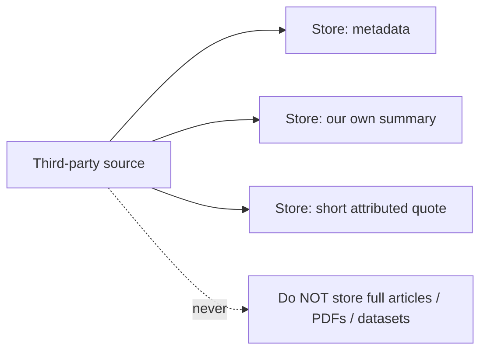

# Legal, copyright and ethics guardrails

> These are hard constraints on the Evidence Graph, enforced in the claim schema, the authoring
> review, and the query engine's output. They mirror the "misleadingly-named / unsafe risks
> (mitigated)" section of [`docs/reviews/motif-v3-1-gap-analysis.md`](../reviews/motif-v3-1-gap-analysis.md).

## What we will NOT claim

- **No legal claims.** The graph never asserts that an interface *is compliant* with any law or
  regulation. Claims carry `legal.compliance_claim_allowed: false`; the engine will not emit a
  "this is legally compliant" statement. It may say "this addresses WCAG 2.4.7" as an
  engineering fact; it will not say "this makes you legally accessible."
- **No medical claims.** Nothing in the graph diagnoses, advises on, or asserts medical fact.
- **No accessibility-certification claims.** The graph helps *find and fix* accessibility issues
  and points at standards, but it never certifies conformance. A passing axe scan is evidence of
  *checked rules*, not a certificate.

Any claim touching these areas sets `legal.disclaimer_required: true`, and the disclaimer is
surfaced wherever the claim is shown (Studio, MCP, reports).

## What we will NOT infer

- **No inferring disability from behaviour.** The `abilities` dimension is a *declared design
  target* (who you intend to support), never a classification of a real user. The graph does not
  observe behaviour and conclude "this user is disabled." See [`ontology.md`](ontology.md) §5.
- **No age stereotypes.** The ontology has no "age" dimension and claims may not encode age-based
  stereotypes ("older users can't…", "Gen-Z expects…"). Audience is modelled by `expertise`,
  `abilities` and `audience_roles`, capability and role, not demographic assumption.

## What we store (and what we do NOT)

For every source we store **only**:
- **metadata**, title, organisation, author, date, URL, tier, methodology, sample, known bias,
  limitations, access type, verification status (the `source` schema fields);
- **our own summaries** of the finding;
- **short, attributed quotations** where wording is load-bearing.

We do **not** reproduce or store full articles, papers, datasets or paywalled content. The graph
links out to sources; it is not a mirror of them. This keeps the layer within fair-use/quotation
norms and respects publishers' copyright. `THIRD_PARTY_SOURCES.md` records provenance.

## Verification and bias are recorded

Each source carries `verification_status` (`verified, pending, unverifiable`),
`commercial_bias` and `limitations`. A claim that rests on a commercially-biased or unverifiable
source is held to it: the bias is shown, and (per the tier rules) it cannot present above its
evidentiary ceiling or block normatively. We surface uncertainty rather than launder it.

## Disclaimers

Where a claim relates to accessibility, legal or safety matters, the consuming surface shows a
disclaimer to the effect of: *"Motif helps identify and address UX and accessibility issues
against published guidance; it does not provide legal, medical or compliance certification.
Verify conformance with a qualified professional."* This is attached automatically when
`disclaimer_required: true`.

## Why this lives in the data, not just the docs

These rules are not advisory prose, they are encoded: `compliance_claim_allowed` and
`disclaimer_required` are schema fields, the ontology deliberately omits age, and `abilities` is
documented as a design target. Authoring review rejects claims that violate them. That way the
guardrails travel with the data into every consumer.
