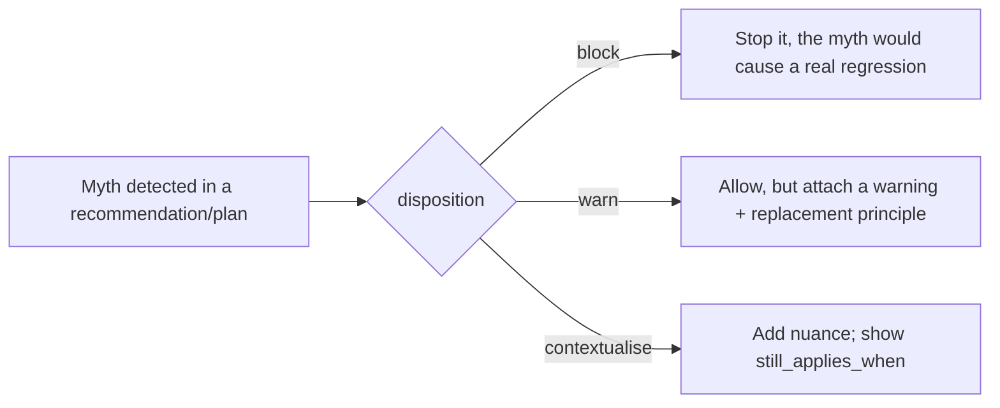

# The myth register

> UX folklore is sticky and often wrong. The myth register is a curated set of widely-repeated
> claims that the evidence does **not** support, each paired with the evidence against it and a
> replacement principle. Schema:
> [`ux-evidence/schemas/myth.schema.json`](../../ux-evidence/schemas/myth.schema.json). Records
> live in [`ux-evidence/myths/`](../../ux-evidence/myths/).

## The myth schema

| Field | Required | Meaning |
|---|---|---|
| `id` | yes | `^myth-[a-z0-9-]+$` |
| `statement` | yes | the myth, stated as believers state it |
| `why_it_spreads` |, | the plausible-sounding reason it persists |
| `evidence_against` | yes | array of references (sources / claims) that refute it |
| `replacement_principle` | yes | what to do *instead* |
| `disposition` | yes | `block, warn, contextualise` |
| `confidence` |, | `high, medium, low` |
| `applicable_contexts` |, | where the myth is most often misapplied |
| `still_applies_when` |, | the narrow cases where the "myth" is actually right |

The `still_applies_when` field matters: most myths are over-generalised truths. "The 3-click
rule" is wrong as a law but the underlying *minimise-friction* instinct is fine in some flows, recording when it still applies keeps the register honest and prevents over-blocking.

## Dispositions



- **block** is reserved for myths whose application causes a concrete harm (e.g. removing focus
  outlines "for aesthetics"). A myth may only carry `block` if it is backed by verified Tier-1
  `evidence_against`, a myth cannot block on the strength of opinion alone, mirroring the
  tier-blocking rule for claims.
- **warn** allows the pattern but surfaces the replacement principle.
- **contextualise** is for myths that are situationally true; it adds nuance rather than
  stopping anything.

## `motif evidence check-myth`

The register is queryable directly so authors and agents can test a proposed approach against
known folklore:

```bash
motif evidence check-myth "users never scroll below the fold"
# → matches myth-below-the-fold
#   disposition: warn
#   evidence_against: [src-nngroup-scrolling, claim-content-priority-not-position]
#   replacement_principle: "Prioritise by importance and scannability, not by the fold line."
#   still_applies_when: ["above-the-fold matters for a single critical CTA on a marketing-site"]

motif evidence check-myth --text "remove the focus ring for a cleaner look"
# → matches myth-remove-focus-outline  (disposition: block, Tier-1 WCAG 2.4.7)

motif evidence check-myth --json   # machine-readable for Guardian / MCP
```

Aliases `ii evidence check-myth`, `oii evidence check-myth`. The same check runs inside the
repair loop (Improve) and Guardian: a proposed change that re-introduces a `block` myth is
refused; one that hits a `warn`/`contextualise` myth proceeds with the principle attached.

## How myths relate to claims and contradictions

- A myth's `replacement_principle` usually points at one or more **claims**, the positive thing
  to do instead.
- A myth is the *negative* counterpart of a claim: where a claim says "do X (evidence: …)", a
  myth says "people believe Y, but (evidence against: …), do the claim's X instead."
- When the field genuinely disagrees, that's a [contradiction](contradictions.md), not a myth.
  A myth is for beliefs the evidence has actually retired.

## Authoring a myth

1. State the myth as its believers state it (don't strawman).
2. Cite `evidence_against`, verified sources/claims, not vibes. The strength of these
   determines the most severe `disposition` allowed.
3. Write the `replacement_principle` and link the positive claim(s).
4. Record `still_applies_when` to prevent over-application.
5. `motif evidence validate` and re-index.
