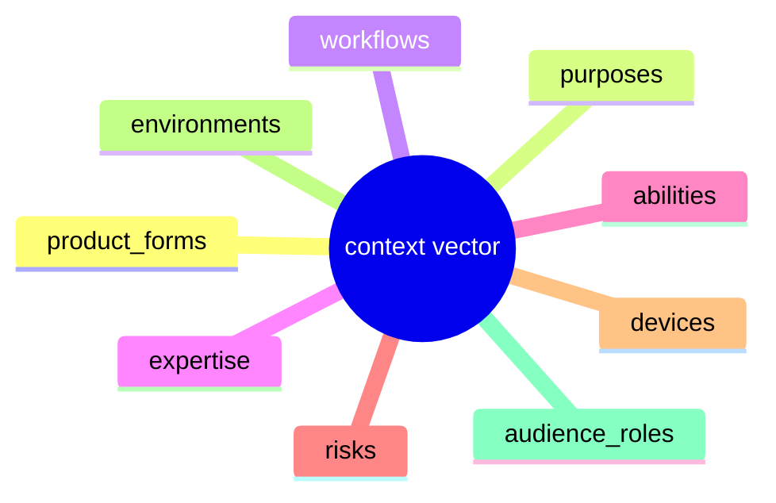

# Ontology, the 9 dimensions and controlled vocabulary

> The ontology is the shared vocabulary every claim, pack and context vector is written in.
> The authoritative source is [`ux-evidence/ontology/`](../../ux-evidence/ontology/) (one YAML
> file per dimension). This page documents it; the YAML is the contract.

## Products are vectors, not categories

A product is **not** "an ecommerce app". A product is a **vector** across nine dimensions, e.g. *web-app + transact + checkout + novice + screen-reader + financial + mobile + public +
beneficiary*. Claims declare the slice of the vector space they apply to (`applicability`), and
the query engine intersects the product's vector with each claim's applicability. This is why
one product can simultaneously match a high-density expert-data-entry claim *and* a strict
keyboard-accessibility claim: it occupies several positions at once.

## The nine dimensions

### 1. product_forms, what kind of thing it is
`web-app, website, public-service-system, ecommerce, enterprise-app, dashboard, mobile-web, documentation, marketing-site, internal-tool`

### 2. purposes, what the user is trying to accomplish
`transact, monitor, analyse, comply, learn, communicate, configure, browse, create, decide, navigate`

### 3. workflows, the task shape, evaluated at screen / workflow level
`daily-operation, onboarding, checkout, data-entry, search-and-filter, bulk-action, approval, reporting, account-management, error-recovery`

> Context is evaluated **per screen / per workflow**, not once for the whole product. A
> checkout screen and a reporting screen in the same app resolve to different context vectors
> and therefore different applicable claims.

### 4. expertise, who the audience is
`novice, intermittent, domain-professional, expert, mixed`

Expertise may change **density and guidance**, but it may **never** weaken accessibility or
safety claims (a merge-rule invariant, see [`query-engine.md`](query-engine.md)).

### 5. abilities, accessibility needs in scope
`motor-impairment, low-vision, blind, colour-vision-deficiency, cognitive, deaf-hard-of-hearing, keyboard-only, screen-reader, low-literacy, none-specified`

> We never *infer* a disability from behaviour. `abilities` is a declared design target, not a
> classification of a real user. See [`legal-and-copyright.md`](legal-and-copyright.md).

### 6. risks, risk is typed, not a number
`low, financial, medical, legal, privacy, safety, reputational, irreversible, emergency`

Risk is a **typed set**, not a 1-5 severity score. A typed risk lets the engine apply the right
guardrail: a `financial` + `irreversible` action triggers confirmation/undo claims; an
`emergency` context triggers latency and clarity claims. Higher-risk guardrails win merges.

### 7. devices, interaction surface
`desktop, touch, mobile, tablet, keyboard, screen-reader, low-power`

### 8. environments, where it is used
`office, factory, field, home, public, clinical, low-connectivity, high-interruption`

### 9. audience_roles, *who* is in front of the interface relative to the outcome
`beneficiary, operator, proxy, observer, administrator`

This dimension separates, e.g., the **beneficiary** of a benefits claim from the **operator**
keying it in and the **proxy** filing on someone's behalf, they have different needs on the
same screen. (`jurisdiction` is also carried on claims and context vectors as a free-text axis
for region-scoped applicability, but it is metadata, not a controlled UX dimension.)

## How the vector is used

- **Claims** carry `applicability` over these dimensions (see
  [`claim-authoring.md`](claim-authoring.md)).
- **Packs** carry a `context_vector` describing a whole product family (see
  [`packs.md`](packs.md)).
- **The Product Context Manifest** carries the product's evaluated vector, with provenance and
  confidence reduction for any dimension that is an *assumption* rather than a stated fact (see
  [`confidence.md`](confidence.md)).
- **The query engine** intersects an input context vector with claim applicability to produce
  applicable claims, warnings, blocked patterns, required validations and conflicts.

## Extending the vocabulary

Adding a value is an additive change: add it to the relevant `ux-evidence/ontology/*.yml`, then
reference it from claims. Removing or renaming a value is a breaking change and must be done
through a migration, because existing claims and packs reference the strings directly.
