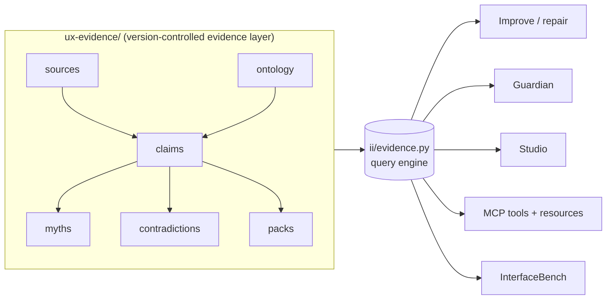

# The UX Evidence Graph, overview

> Part of Motif v3.1 "Evidence-Grounded Runtime". Status mirrors
> [`docs/reviews/motif-v3-1-gap-analysis.md`](../reviews/motif-v3-1-gap-analysis.md) and
> [`docs/adr/ADR-UXE-001-release-and-integration-strategy.md`](../adr/ADR-UXE-001-release-and-integration-strategy.md).
> The deterministic Evidence Graph (data + query engine + CLI + MCP) is **implemented**.
> Browser-executed steps are **experimental / not-executed** in this environment (pip is
> broken; a browser runtime cannot be installed or run here).

## What it is

The UX Evidence Graph is a **version-controlled evidence layer**: a curated, machine-readable
body of UX claims, the sources behind them, the contexts in which they apply, and the myths
they retire. It lives in the repository under [`ux-evidence/`](../../ux-evidence/) as flat
YAML/JSON files plus generated indexes, and it is queried deterministically by one engine
(`ii/evidence.py`).

It exists so that every recommendation Motif makes can answer a single question honestly:
**"on what evidence, and how strong, and in what context?"**

## What it is NOT

- **Not a graph database.** There is no Neo4j, no server, no query language to learn. It is
  files in git. "Graph" describes the shape of the data (claims linked to sources, contexts,
  myths and contradictions), not the storage engine. You read it with `git`, diff it in a PR,
  and review it like code.
- **Not a UX encyclopedia.** It does not try to teach UX or restate textbooks. It stores only
  what Motif needs to *ground a decision*: a claim, its applicability vector, its evidence tier
  and confidence, how to detect and validate it, and its freshness. It stores **metadata,
  summaries and short quotations**, never full articles (see
  [`legal-and-copyright.md`](legal-and-copyright.md)).
- **Not an oracle.** It returns applicable claims, warnings, blocked patterns, required
  validations and *unresolved conflicts*. It is explicit about what it does not know.

## Who consumes it

| Consumer | Uses the evidence layer to… |
|---|---|
| **Improve** | ground each repair in a verified claim; refuse to "fix" what evidence doesn't support; pick validations. |
| **Guardian** | resolve the context vector for changed files and apply only the claims that apply, blocking normative violations. |
| **Studio** | display the evidence, sources and limitations behind a recommendation (read-only). |
| **MCP** | expose `evidence`/`check-myth` tools and the claim/pack/myth resources to agents. |
| **InterfaceBench** | provide the grounded expectations a scored scenario is measured against. |

## Design principles

1. **Evidence before assertion.** A recommendation with no claim behind it does not ship.
2. **Confidence is derived, never asserted.** See [`confidence.md`](confidence.md).
3. **Context is evaluated, not assumed.** A claim applies to a *context vector*, not "the web".
4. **Hypotheses never block.** Tier 5-6 evidence can only raise a hypothesis to validate.
5. **Stale loses confidence.** Old claims decay; they cannot *newly* block.
6. **No legal/medical/a11y-certification claims.** See [`legal-and-copyright.md`](legal-and-copyright.md).

## Where to go next

- [`ontology.md`](ontology.md), the 9 dimensions and controlled vocabulary.
- [`evidence-tiers.md`](evidence-tiers.md), tiers 1-6 and what may block.
- [`claim-authoring.md`](claim-authoring.md), the claim schema and how to add one.
- [`query-engine.md`](query-engine.md), input/output contract and the 10 merge rules.
- [`packs.md`](packs.md), the three grounded packs.
- [`myths.md`](myths.md) / [`contradictions.md`](contradictions.md), retiring folklore and handling disagreement.
- [`browser-integration.md`](browser-integration.md), the optional `motif[browser]` extra (experimental / not-executed).
- [`legal-and-copyright.md`](legal-and-copyright.md), what we will not claim or store.
