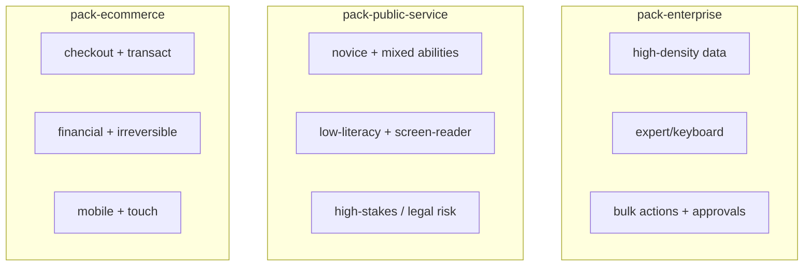

# Evidence packs

> A pack bundles the claims, anti-patterns, myths-to-block and required validations that apply
> to a whole product family, behind one context vector. It is a convenience layer over the
> claim set, a way to say "for an app like this, here is the grounded baseline." Schema:
> [`ux-evidence/schemas/evidence-pack.schema.json`](../../ux-evidence/schemas/evidence-pack.schema.json).
> Packs live in [`ux-evidence/packs/`](../../ux-evidence/packs/).

## The pack schema

| Field | Required | Meaning |
|---|---|---|
| `id` | yes | `^pack-[a-z0-9-]+$` |
| `name` | yes | human label |
| `context_vector` | yes | the product family's position across the 9 dimensions |
| `claim_ids` | yes | claims that form this pack's baseline |
| `anti_pattern_ids` |, | claims of `type: anti-pattern` to flag |
| `myths_to_block` |, | `myth-…` ids this family must not fall for |
| `required_validations` |, | `val-…` ids that must be run to consider the family validated |
| `evidence_floor` |, | minimum tier the pack vouches for |
| `known_gaps` |, | honestly listed things the pack does *not* yet cover |
| `confidence` |, | `high, medium, low` for the pack as a whole |

`known_gaps` is mandatory in spirit: a pack states what it doesn't cover so consumers don't
mistake silence for assurance.

## The three packs

### 1. `pack-enterprise`
Context: `enterprise-app, internal-tool, dashboard` × `analyse, monitor, configure` ×
`data-entry, bulk-action, approval, reporting` × `domain-professional, expert` ×
`keyboard, desktop, screen-reader` × `office`.
Emphasis: information density appropriate to experts, keyboard-first operation, safe bulk
actions and approvals, error recovery. Expertise here may **raise density** but the pack still
carries the non-negotiable accessibility and safety claims (expertise never weakens them).

### 2. `pack-public-service`
Context: `public-service-system, website` × `comply, transact, learn` × `onboarding, data-entry, error-recovery` × `novice, intermittent, mixed` × the full `abilities` range ×
`mobile, screen-reader, low-power` × `public, low-connectivity, high-interruption`, roles
`beneficiary, proxy, operator`.
Emphasis: plain language, low-literacy and screen-reader support, resilience on poor
connections, and high-stakes (`legal`, `privacy`) safeguards. Highest accessibility floor.

### 3. `pack-ecommerce`
Context: `ecommerce, mobile-web` × `transact, browse, decide` × `checkout, account-management, search-and-filter` × `novice, intermittent` × `touch, mobile, desktop`
× `home, public`, risks `financial, irreversible`.
Emphasis: friction-minimised but safe checkout, confirmation/undo on consequential and
irreversible actions, trust and feedback. Blocks the "confirm everything" and "hidden cost"
myths.

## How packs are used

- **As a starting context.** `motif evidence query --pack pack-ecommerce` resolves the pack's
  context vector through the engine and returns applicable claims, warnings, blocked patterns,
  required validations and conflicts, the same output as any context query.
- **As a Guardian baseline.** Guardian can be pointed at a pack to enforce its `claim_ids` and
  `myths_to_block` on changed files.
- **As a bench seed.** InterfaceBench scenarios use a pack to define grounded expectations (see
  [`../interfacebench/vue-dashboard-evidence-repair.md`](../interfacebench/vue-dashboard-evidence-repair.md)).

A pack does not override the merge rules: a claim included in a pack still resolves by tier,
force, specificity and freshness when the actual product context is more specific than the
pack's family vector.

## Authoring / extending a pack

1. Define the `context_vector` for the family honestly.
2. List `claim_ids` that form the baseline; add `anti_pattern_ids` and `myths_to_block`.
3. Set `required_validations`, `evidence_floor`, and, importantly, `known_gaps`.
4. `motif evidence validate` and re-index; smoke-query with `--pack`.
