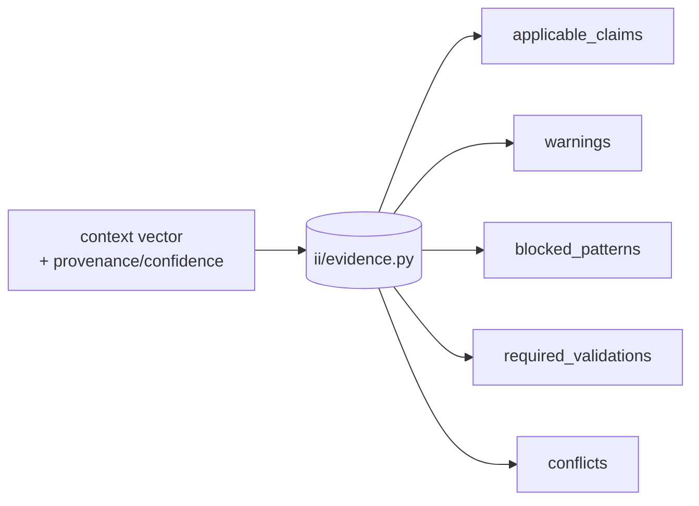
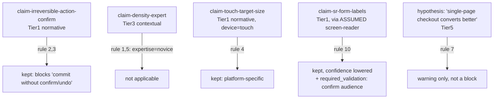

# The query engine

> One deterministic engine (`ii/evidence.py`) turns a product's **context vector** into a
> grounded, merged answer. It is dependency-free, part of `make check`, and the single path all
> consumers (Improve, Guardian, Studio, MCP, InterfaceBench) go through. **Implemented.**

## Input → output contract



**Input**, a `context-vector` (schema
[`context-vector.schema.json`](../../ux-evidence/schemas/context-vector.schema.json)) over the
9 dimensions (+ `jurisdiction`), optionally annotated with per-dimension provenance
(`stated` / `assumed`) from the Product Context Manifest.

**Output**, a structured query result:

| Field | Meaning |
|---|---|
| `applicable_claims` | claims whose `applicability` intersects the context, each with **effective confidence** and the reasons it was lowered |
| `warnings` | non-blocking concerns: stale claims, assumed-critical context, `warn`/`contextualise` myths |
| `blocked_patterns` | patterns a verified, current, normative Tier-1 claim (or `block` myth) forbids |
| `required_validations` | `val-…` methods that must run to confirm a hypothesis or an assumed context |
| `conflicts` | unresolved contradictions, returned with both competing claims, tiers and sources |

```bash
motif evidence query --context examples/checkout-mobile.json --json
motif evidence query --pack pack-ecommerce
motif evidence explain claim-irreversible-action-confirm   # why it applied / what lowered it
```
Aliases `ii evidence`, `oii evidence`.

## The 10 merge rules

When multiple claims match the same concern, the engine merges them by these rules, in this
order. They are invariants, tested by `make check`.

1. **Specificity wins.** A claim matching more (and more specific) context dimensions outranks a
   broader one on the same concern. (`novice`-specific density guidance beats generic density.)
2. **Normative cannot be overridden by weaker.** A `normative` claim is never displaced by a
   `strong-recommendation`, `contextual-recommendation` or `hypothesis`, however specific the
   weaker one is.
3. **Higher-risk guardrails win.** Where typed `risks` collide, the stricter guardrail (the one
   protecting the higher-stakes risk: `safety`/`irreversible`/`emergency`/`legal`) is kept.
4. **Platform-specific outranks generic.** A device/platform-scoped claim (`touch`, `mobile`,
   `screen-reader`) outranks an unscoped one for that platform.
5. **Expertise may change density, not weaken a11y/safety.** Higher `expertise` may raise
   information density or reduce hand-holding, but may **never** weaken an accessibility or
   safety claim. This bound is hard.
6. **Real conflicts are returned, not hidden.** Genuine, unresolved contradictions go into
   `conflicts` with both sides, the engine does not silently pick one. (See
   [`contradictions.md`](contradictions.md).)
7. **Hypotheses never block.** Tier 5-6 / `hypothesis`-force claims can only produce warnings or
   `required_validations`, never `blocked_patterns`. (See [`evidence-tiers.md`](evidence-tiers.md).)
8. **Stale cannot newly block.** A `stale`/past-`review_after` claim has reduced confidence and
   may not introduce a *new* block; it may only continue an established normative block until
   re-reviewed. (See [`confidence.md`](confidence.md).)
9. **Expose sources and limitations.** Every applicable claim carries its `sources`,
   `limitations` and the reasons its confidence was lowered, the result is auditable, never an
   opaque score.
10. **Assumed critical context lowers confidence and demands validation.** When a claim applies
    only because a *critical* dimension (`risks`, `abilities`, `expertise`) was `assumed` rather
    than `stated`, its effective confidence is lowered and a `required_validation` to confirm the
    context is emitted.

## Worked merge example

Context: `ecommerce, checkout, transact, novice, mobile, touch, financial, irreversible`,
with `abilities: [screen-reader]` marked **assumed**.



Result: two normative blocks (confirm/undo, touch target size), one accessibility claim at
reduced confidence with a validation to confirm the assumed audience, and one hypothesis
surfaced as a warning, never as a block.

## Determinism

Given the same `ux-evidence/` content and the same input vector, the engine returns byte-stable
output. There is no model call in the merge path, no network, and no randomness, which is what
lets Guardian and InterfaceBench depend on it and what keeps it inside `make check`.
